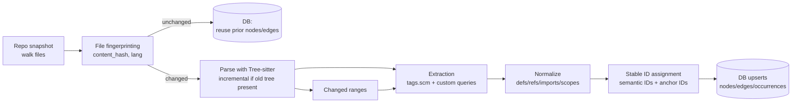

# Parsing Codebases into a Persistent Graph with Tree-sitter

## Executive summary

Tree-sitter produces a **concrete syntax tree (CST)** that includes tokens like punctuation, but it explicitly supports treating the tree “like an AST” by filtering down to **named nodes**, which correspond to named grammar rules (and skipping anonymous token nodes). citeturn6view4turn3search5 This makes it practical to extract **high-level structural entities**—files, top-level definitions, methods, imports—without storing every token.

For graph construction, there are two “ready-made” building blocks worth reusing instead of starting from scratch:

* **Tagging via query files (`queries/tags.scm`)**: Tree-sitter documents a standardized “tagging” convention using captures like `@definition.function` plus an inner `@name`, with optional `@doc` and helper directives for docstrings; the `tree-sitter tags` tool can emit a textual dump and `tree-sitter test` can unit-test tags queries. citeturn9view0turn5view3  
* **Graph construction DSL and name-resolution graphs**: `tree-sitter-graph` is a DSL/library for constructing graph structures from Tree-sitter parses, and **stack graphs** (from entity["organization","GitHub","software hosting company"]) provide a file-incremental graph-based approach to name resolution “at scale,” designed to avoid reanalyzing unchanged files and to work without build integration. citeturn5view2turn5view6turn5view5

For persistence and stable IDs, the most robust pattern is to separate:

1) **Stable semantic identities** for “real” entities (definitions, modules, packages) using a scheme akin to **SCIP symbols** (human-readable, structured IDs) or **Kythe VNames/tickets**, and  
2) **Anchors/occurrences** for spans in files (byte/point ranges) that may legitimately change across edits. citeturn15view0turn13view4turn13view0

For fast updates, Tree-sitter supports **incremental parsing** by editing the old tree (`ts_tree_edit` / `Tree.edit`) and reparsing while reusing unchanged structure; it also exposes **changed ranges** to focus downstream re-indexing work. citeturn6view5turn10view1turn10view0

A practical prototype architecture is: **file snapshot → parse → query-based extraction (tags + imports + scopes) → stable-ID assignment → persist nodes/edges** in a relational DB (SQLite for local, PostgreSQL for shared/large), with a “per-file graph blob” cache keyed by file content hash to minimize recomputation. citeturn17search4turn17search1turn10view0turn5view6

## Tree-sitter capabilities that matter for CST-to-graph pipelines

Tree-sitter’s core design points for this problem are: **CST output**, **named-node filtering**, **incremental parsing**, **pattern queries**, and **error-tolerant trees**.

Tree-sitter explicitly produces **concrete** syntax trees and explains the named/anonymous distinction: punctuation/keywords are typically anonymous nodes, while higher-level grammar rules are named nodes; using “named child” APIs effectively yields an AST-like view. citeturn6view4turn3search5

Tree-sitter queries provide a structured pattern language with captures, field constraints, and special nodes (including `(ERROR)` and `(MISSING)`), which is critical both for extraction and for correctness auditing. citeturn6view1turn6view3

For incremental parsing, Tree-sitter provides a two-step process: **edit** the existing tree with a `TSInputEdit`, then parse again while passing the old tree to reuse unchanged subtrees (“shares structure with the old tree”). citeturn6view5turn10view0 The API also exposes `ts_tree_get_changed_ranges` / `Tree.changed_ranges` to compute ranges whose syntactic structure changed. citeturn10view0turn10view1

Important operational notes for performance and concurrency:

* Tree-sitter offers a **TreeCursor** for efficient traversal; this is recommended by the Python docs for walking many nodes. citeturn10view1  
* Some child-access APIs have nontrivial asymptotic costs (e.g., Rust docs note `child(i)` is technically `log(i)` and recommend iterating with a cursor for large scans). citeturn21view0  
* Syntax trees are **not thread-safe**; the C API advises copying a tree to use it in more than one thread. citeturn11view0

Finally, grammar/version management is part of correctness: `ts_parser_set_language` can fail on ABI mismatch between the compiled language and the library, and Tree-sitter exposes language metadata intended to signal query compatibility across semantic versions. citeturn22view0turn10view0

## Mapping Tree-sitter nodes to a codebase graph

### A recommended graph “spine”

A codebase graph that supports navigation, structure queries, and incremental rebuilds typically needs at least these node categories:

* **Repository / snapshot** (optional but useful if you plan to store multiple versions)
* **File** (and sometimes “document”)
* **Definition symbol** (class/function/method/module/type, etc.)
* **Occurrence / anchor** (“this span of text is a definition/reference/call/import occurrence”)
* **Import / dependency edges**
* **Containment edges** (file contains definition; definition contains member definition)

This separation mirrors well-established indexing schemas:

* **Kythe** models *semantic nodes* plus *anchors* that denote regions of a file, and locations are obtained by associating semantic nodes with anchors. citeturn13view0turn13view5  
* **SCIP** models documents plus occurrences and symbol information, and it standardizes symbol identities to support navigation like “go to definition” and “find references.” citeturn15view0turn16view0  
* **LSIF** defines a dump format for tooling knowledge to answer LSP-like requests later, acknowledging that edits invalidate much of the data. citeturn5view9turn16view1

### Use tags queries as your “high-level node extractor”

Tree-sitter’s “Code Navigation Systems” documentation describes tagging as scanning syntax trees with queries and captures, using the capture naming convention `@role.kind` and a mandatory inner `@name`, plus optional `@doc`. citeturn9view0 It also provides a standard vocabulary (e.g., `@definition.function`, `@definition.class`, `@reference.call`) and describes using `tree-sitter tags` to test queries and `tree-sitter test` for unit tests. citeturn9view0turn5view3

This is not theoretical: entity["organization","GitHub","software hosting company"] documents that its search-based code navigation is built on Tree-sitter and tag queries, and provides a standardized set of symbol categories and capture tags (and a mechanism for fully qualified names using `@scope` captures when needed). citeturn5view4turn5view1

**Practical implication:** for a multi-language codebase graph, you can treat `queries/tags.scm` (plus your own extra queries) as the stable contract between “language grammar details” and “your graph schema.” citeturn9view0turn5view1

### Imports, modules, and scopes

Tree-sitter tags cover many definition/reference use cases, but you will almost certainly add language-specific queries for:

* **Imports / includes / requires**
* **Module/package declarations**
* **Export declarations**
* **Scope boundaries** (blocks, functions, classes)

Two implementation directions exist:

* **Heuristic resolution**: record imports and references as edges without fully resolving them (fast, language-agnostic, but less correct).
* **Name-resolution layer**: integrate a resolver (stack graphs or LSP/compiler-backed index) to map reference occurrences to definition symbols.

Stack graphs were built to provide precise code navigation with a purely syntactic pipeline, using a declarative graph construction language, and they emphasize **file-incremental** subgraphs to amortize costs at forge scale. citeturn5view6turn5view5 This matters because Tree-sitter alone gives you syntax, not language-specific binding rules.

If you need **compiler-accurate** cross-file resolution, there’s a complementary path: emit your structural graph, but rely on existing code-intel indexers and formats like SCIP for precise symbol identity and reference resolution (often compiler/typechecker-based). citeturn16view1turn15view0

### Graph extraction pattern

A robust extraction pass per file typically looks like:

1) Parse file text into a tree.
2) Run one or more queries:
   * `tags.scm` (definitions, references, docstrings)
   * `imports.scm` (your own)
   * optionally `locals.scm` / “scope” queries if you want block-level scope metadata
3) Normalize into intermediate records:
   * `Definition {kind, name, scope_path, span, doc}`
   * `Reference {kind, name, span, context}`
   * `Import {imported_module/name, alias, span}`
4) Derive **qualified names** / symbol identity.
5) Persist nodes and edges.

Tree-sitter queries support field names, captures, anchors, predicates and directives—use these to make extractions precise and resilient. citeturn6view1turn6view2turn6view3turn9view0

## Stable IDs, serialization, and migration strategy

### Why Tree-sitter node IDs are insufficient as persistent IDs

Tree-sitter node handles have an internal `id`, but it is defined as a unique ID **within a syntax tree**, and (in Rust docs) it may be reused across incremental parses if the node is reused—yet reuse is not guaranteed just because a node is “unchanged,” and nodes marked changed are not reused. citeturn21view0 This is useful for **within-process incremental bookkeeping**, but it is not a database primary key you can rely on across runs.

### Recommended stable ID layers

A practical stable-ID design uses two layers:

**Semantic IDs (stable across reloads, and often across small edits)**  
Use a deterministic ID derived from semantic identity:

* Language
* Package/module namespace (if applicable)
* Fully qualified name / descriptor path
* Optional disambiguator (signature hash, overload index, receiver type)

This mirrors both:

* **Kythe VName**: a structured name vector including `signature`, `corpus`, `root`, `path`, and `language`, with compatibility rules (fields not removed, etc.). citeturn13view4turn13view2  
* **SCIP Symbols**: a standardized string representation meant to uniquely identify entities across a package; SCIP explicitly positions “symbols” as unique identifiers and documents descriptor paths that form a fully-qualified name. citeturn15view0turn16view1

Kythe’s schema also explicitly allows the `signature` to be encoded arbitrarily as long as collisions are “vanishingly small,” enabling one-way hashes for large signatures. citeturn13view1 This is exactly the justification you want for hashed stable IDs.

**Anchor/occurrence IDs (stable for a given file version)**  
For occurrences, use `(file_id, start_byte, end_byte, role, kind)` plus perhaps a hash of the matched `@name` text. This aligns with Kythe’s anchor notion (anchors denote regions) and SCIP’s document occurrences. citeturn13view0turn15view0

### Serialization formats you can adopt (even if you store in a DB)

Even if your primary persistence is a database, adopting an interchange format helps testing, migrations, and tooling integration:

* **SCIP**: Protobuf schema, with index metadata (protocol version, tool info, project root, encodings) and a design explicitly targeting scalable indexing with human-readable symbol IDs. citeturn15view0turn16view1  
* **Kythe**: a graph-store model of entries (node/edge facts) and a schema for cross-references; it’s explicitly intended for sharing “interesting subsets” rather than replacing all IRs. citeturn5view8turn13view5  
* **LSIF**: JSON graph dump to answer LSP requests offline, but the spec highlights invalidation under edits and the ecosystem’s challenges with opaque numeric IDs (motivating SCIP). citeturn5view9turn16view1

### Versioning and migrations

You need versioning at three levels:

* **DB schema version**: classic migrations.
* **Index schema/version** (“graph schema version”): bump when your node/edge meanings change.
* **Parser/query versions**: store grammar identity and query identity.

Tree-sitter itself acknowledges grammar/query compatibility risks: language metadata is intended to signal when a parser upgrade might break existing queries, and `ts_parser_set_language` can fail on ABI mismatch between the grammar and the library. citeturn22view0turn10view0

A practical pattern is to store, per indexed file snapshot:

* `tree_sitter_language_abi` (or binding version)
* grammar repo/version (if known)
* query bundle version (your own `tags.scm` snapshot hash)
* indexer version (your tool)
* graph schema version

## Databases and schemas for persisted node graphs

### Database options

For a prototype and many production deployments, you don’t need a specialized graph database; you need **fast writes**, **indexes**, and **bulk upserts**.

*SQLite (embedded, local-first)*  
SQLite is an in-process, serverless, zero-configuration transactional SQL engine. citeturn17search4turn17search0 This is ideal for a single-machine prototype, per-repo caches, and local developer tooling.

*PostgreSQL (shared, concurrent, rich indexing)*  
PostgreSQL provides JSON types (`json`/`jsonb`) with validity checking and JSON-specific functions/operators, enabling a hybrid relational+document approach for flexible node properties. citeturn17search1turn17search9

*Graph database (property graph; when you truly need deep graph traversal queries)*  
entity["company","Neo4j","graph database vendor"] describes the property graph model as nodes connected by relationships, with properties on both. citeturn17search2turn17search10

*Key-value storage (very large-scale caches, per-file blobs)*  
RocksDB positions itself as an embeddable persistent key-value store; keys/values are arbitrary byte arrays, tuned for performance. citeturn17search3turn17search11

### Recommended relational schema

A minimal schema that supports stable IDs, incremental updates, and graph edges:

```sql
-- Core identity: stable semantic nodes
CREATE TABLE symbol (
  symbol_id      BLOB PRIMARY KEY,      -- e.g., 16-byte UUIDv5 or 32-byte hash
  language       TEXT NOT NULL,
  kind           TEXT NOT NULL,          -- "class" | "function" | "method" | "module" ...
  qualified_name TEXT NOT NULL,          -- normalized FQN
  disambiguator  TEXT NOT NULL DEFAULT '',
  metadata_json  JSON,                   -- optional
  created_at     TIMESTAMP NOT NULL
);

-- Files are also stable nodes
CREATE TABLE file (
  file_id        BLOB PRIMARY KEY,       -- hash(repo, normalized_path)
  repo_key       TEXT NOT NULL,           -- e.g., repo URL or local root ID
  relative_path  TEXT NOT NULL,
  language       TEXT NOT NULL,
  content_hash   BLOB NOT NULL,           -- hash(file bytes)
  size_bytes     INTEGER NOT NULL,
  mtime_ns       INTEGER NOT NULL
);

-- Occurrences are anchors in a specific file version
CREATE TABLE occurrence (
  occurrence_id  BLOB PRIMARY KEY,        -- hash(file_id, content_hash, span, role, kind, name?)
  file_id        BLOB NOT NULL REFERENCES file(file_id),
  content_hash   BLOB NOT NULL,           -- ties occurrence to a file version
  role           TEXT NOT NULL,           -- "definition" | "reference" | "call" | "import"
  kind           TEXT NOT NULL,           -- aligns with capture kind where possible
  name_text      TEXT NOT NULL,
  start_byte     INTEGER NOT NULL,
  end_byte       INTEGER NOT NULL,
  start_row      INTEGER,
  start_col      INTEGER,
  end_row        INTEGER,
  end_col        INTEGER,
  symbol_id      BLOB NULL REFERENCES symbol(symbol_id), -- resolved target if known
  extra_json     JSON
);

-- Typed edges between stable nodes (and optionally occurrences)
CREATE TABLE edge (
  edge_id        BLOB PRIMARY KEY,        -- hash(src, type, dst, qualifiers)
  src_symbol_id  BLOB NOT NULL REFERENCES symbol(symbol_id),
  edge_type      TEXT NOT NULL,           -- "contains" | "imports" | "calls" | "inherits" ...
  dst_symbol_id  BLOB NOT NULL REFERENCES symbol(symbol_id),
  extra_json     JSON
);

CREATE INDEX idx_file_repo_path ON file(repo_key, relative_path);
CREATE INDEX idx_occ_file_version_span ON occurrence(file_id, content_hash, start_byte, end_byte);
CREATE INDEX idx_edge_src_type ON edge(src_symbol_id, edge_type);
```

This schema supports:

* Stable symbol identity (semantic IDs)
* Multiple versions of the same file (by `content_hash`)
* Occurrence anchoring to a specific file version
* Typed graph edges between symbols

If you need a pure “property graph in SQL,” you can collapse `file` and `symbol` into a unified `node` table plus an `edge` table; but in practice, dedicated tables improve indexing and integrity.

## Incremental updates, performance bottlenecks, and concurrency

### Fast update strategy

A realistic incremental approach is multi-level:

**File-level change detection**  
Maintain `content_hash` per file. If unchanged, do nothing. This is often the dominant win for large repositories.

**Incremental parsing for edited files in a long-running process**  
When you have an old syntax tree, Tree-sitter supports editing it (`Tree.edit` / `ts_tree_edit`) and reparsing with old-tree reuse; the Python bindings explicitly show `new_tree = parser.parse(new_src, tree)` and note this is “much faster than parsing from scratch.” citeturn10view1turn6view5

**Targeted re-indexing using changed ranges**  
Compute syntactically changed ranges and re-run extraction only where needed: the C API provides `ts_tree_get_changed_ranges`, and Python exposes `Tree.changed_ranges(new_tree)`. citeturn10view0turn10view1  
Additionally, query cursors support restricting execution to a byte range (Tree-sitter has APIs for setting query byte ranges, and py-tree-sitter moved range restriction to `QueryCursor.set_byte_range`). citeturn23search2turn23search0

**Reusing work across commits and large history**  
Stack graphs’ paper emphasizes file-incremental graph construction and avoiding reanalysis of file versions already seen, amortizing indexing costs when most commits touch a small fraction of files. citeturn5view6

### Expected bottlenecks

In practice, bottlenecks usually shift in this order as scale grows:

1) **Disk I/O** (reading millions of files repeatedly)
2) **Query execution** (especially if queries are non-local and disable optimizations) citeturn23search5
3) **DB write amplification** (too many small transactions / per-row updates)

Performance notes grounded in the APIs:

* For traversal-heavy logic, prefer cursor-based iteration; Python and Rust docs both emphasize cursor use for large traversals. citeturn10view1turn21view0  
* For concurrency, don’t share a syntax tree across threads without copying; the C API explicitly states trees are not thread safe. citeturn11view0  
* You can parse from a callback-based “rope/piece table” representation (TSInput) for editor-like use cases where you don’t want to materialize full strings. citeturn6view4turn10view0

For truly large-scale reference points: Kythe’s published talk cites a “small dataset (Chromium)” with ~22,600 C++ compilations producing ~31GB of serving data, and notes much larger internal deployments. citeturn18view0 This is a useful sanity check on storage growth when you move from “structure graph” to “semantic cross-reference graph.”

### Concurrency model

A practical multi-process design is:

* One “dispatcher” walks the repo and assigns files to worker processes.
* Workers are sharded by language (or by “grammar bundle”) to keep parsers and query sets warm.
* Workers emit normalized extraction records to a writer process that batches DB writes.

This is consistent with Tree-sitter’s per-file parsing model and avoids thread-safety pitfalls around sharing trees. citeturn11view0turn6view4

## Ecosystem, language caveats, correctness pitfalls, and testing

### Ecosystem you can leverage

* **`tree-sitter tags` + `queries/tags.scm`**: official documentation standardizes captures and provides a testing approach. citeturn9view0turn5view3  
* **GitHub’s public guidance**: describes tag queries, symbol kinds, and fully-qualified-name extraction conventions (`@scope`). citeturn5view1turn5view4  
* **`tree-sitter-graph`**: provides a DSL/library for building arbitrary graphs from parsed source. citeturn5view2turn20search27  
* **Stack graphs**: graph-based name binding/resolution, file-incremental, built for large-scale navigation without build integration. citeturn5view6turn5view5  
* **SCIP/LSIF/Kythe**: mature schemas/formats for code intelligence graphs, useful as references or export targets. citeturn16view1turn5view9turn13view5  
* **LSP interoperability**: LSP is layered on JSON-RPC, which matters if you decide to pull precise semantics from language servers. citeturn2search6turn2search21

### Language-specific caveats that impact graph correctness

**Preprocessor-heavy languages (C/C++)**  
Tree-sitter grammars operate on source text without macro expansion; macro-heavy code can therefore parse poorly or produce errors, and grammar authors discuss limitations around how macros can appear around tokens. citeturn19search0turn19search5turn19search3  
If your codebase relies heavily on preprocessing for structural constructs, you should expect:
* More `(ERROR)` / `(MISSING)` nodes in trees. citeturn6view1turn21view0  
* Lower-quality symbol extraction unless you add a preprocessing step or custom mitigation.

**Multi-language documents**  
Tree-sitter can parse only included ranges of a document (e.g., template languages) and can build overlapping trees across ranges. citeturn7view0turn10view0 Your graph model should allow multiple “language layers” per file or treat embedded code as separate virtual documents.

**Error-tolerant parsing**  
Tree-sitter can represent unrecognized text as `(ERROR)` nodes and inserted recovery tokens as `(MISSING)`. citeturn6view1turn21view0 For indexing, this implies you should:
* Store a “parse_health” indicator per file (e.g., `has_error` at root).
* Avoid asserting that a missing capture means “no symbol,” because the tree may be degraded.

### Security and robustness pitfalls

**Native-code parsers on untrusted inputs**  
Tree-sitter grammars are native code; treat parsing untrusted repositories as a sandboxed workload (process-level isolation, resource limits). The C API supports cancellation via a progress callback (parse-with-options) so that you can enforce time budgets per file. citeturn22view0turn12view3

**Generated code**  
Generated code explodes index size and can harm “signal-to-noise.” Kythe explicitly documents strategies for modeling generated code and linking it back to sources instead of privileging the generated implementation. citeturn13view3 Even if you’re not using Kythe, the principle applies: tag generated paths and down-rank or redirect.

### Testing and validation strategy

Tree-sitter’s code-nav docs describe a concrete unit-testing approach for tags queries using `tree-sitter test` and annotated fixtures under `test/tags/`. citeturn9view0turn5view3 Use this as your first correctness gate.

For graph-level validation, add:

* **Snapshot tests** of extracted entities/edges per file and per language.
* **Round-trip stability tests**: parse → persist → reload → reparse unchanged → ensure stable IDs and entity counts match.
* **Differential validation**: compare extracted definitions against an independent baseline (ctags, or an LSP server’s document symbols) for sampled projects.
* **Performance regression tests**: measure time/file and DB write rates; SCIP’s design and entity["company","Sourcegraph","code search company"]’s discussion of LSIF pain points highlights how opaque graph IDs complicate debugging and incremental indexing—use human-readable symbol IDs (or at least loggable IDs) to simplify diagnostics. citeturn16view1turn15view0

## Comparison table

High-level comparison of reusable tooling and persistence options (focus: graph extraction, stable IDs, incremental updates, maturity).

| Option | What you get | Language coverage | Incremental parsing support | Stable ID story | Persistence story | Maturity signal |
|---|---|---:|---:|---|---|---|
| Tree-sitter + `queries/tags.scm` | Standard captures for defs/refs/calls + CLI tooling and unit tests | Broad (depends on grammar + tags queries) citeturn9view0turn5view1 | Yes (edit + parse old tree + changed ranges) citeturn10view1turn10view0 | You define it; tags provide names/scopes citeturn9view0turn5view1 | Your DB | Used for code navigation systems and documented for integration citeturn9view0turn5view4 |
| `tree-sitter-graph` | DSL to construct arbitrary graphs from parses | Whatever you author DSL rules for citeturn5view2turn20search16 | Compatible with incremental parse inputs (depends on your pipeline) | You define it | Your DB | Dedicated project + docs/CLI/extension citeturn5view2turn20search27 |
| Stack graphs | Declarative name-binding graphs; file-incremental resolution | Limited by available rules; framework is general citeturn5view6turn5view5 | Designed for file-incremental construction citeturn5view6 | Graph identities designed for navigation; you still choose storage IDs | Typically persisted subgraphs + lookup | Research paper + production use case described citeturn5view6turn5view5 |
| SCIP | Standard semantic index format (docs, occurrences, symbol info) | Growing ecosystem of indexers citeturn16view0turn14view3 | Designed to support incremental indexing better than LSIF citeturn16view1 | Standard symbol syntax; human-readable IDs citeturn15view0turn16view1 | Store Protobuf or ingest into DB | Protobuf schema + multiple indexers citeturn14view3turn15view0 |
| Kythe | Graph schema + storage model + xref services | Requires compiler-backed indexers/extractors citeturn13view5turn18view0 | “Quick incremental updates” is an explicit goal; build-integrated citeturn18view0 | VName/tickets; signature hashing allowed citeturn13view4turn13view1 | Graph store as entries/facts citeturn5view8turn13view5 | Mature research/industry project + docs citeturn13view5turn18view0 |
| SQLite | Embedded transactional persistence | N/A | N/A | Your schema/IDs | Single-file DB, serverless citeturn17search4turn17search0 | Widely deployed citeturn17search0 |
| PostgreSQL | Shared relational + JSONB hybrid | N/A | N/A | Your schema/IDs | Strong JSON types + functions citeturn17search1turn17search9 | Widely used, rich tooling |
| Neo4j | Native property graph query engine | N/A | N/A | Your schema/IDs | Nodes + relationships + properties citeturn17search2turn17search10 | Mature graph DB ecosystem citeturn17search2 |
| RocksDB | High-performance embedded KV store | N/A | N/A | Your key design | Ordered KV store citeturn17search11turn17search3 | Mature storage engine citeturn17search11 |

## Recommended end-to-end architecture and prototype plan

### Architecture


citeturn10view1turn10view0turn9view0turn23search0

### Implementation patterns and pseudocode

**Core extraction loop (Python-style pseudocode)**

```python
from dataclasses import dataclass
from hashlib import sha256

@dataclass(frozen=True)
class SymbolKey:
    language: str
    kind: str
    qualified_name: str
    disambiguator: str = ""

def stable_id(*parts: str) -> bytes:
    h = sha256()
    for p in parts:
        h.update(p.encode("utf-8"))
        h.update(b"\0")
    return h.digest()  # 32 bytes; store as BLOB/bytea

def file_id(repo_key: str, rel_path: str) -> bytes:
    # Ensure canonical rel_path (no leading '/', no '..', use '/')
    return stable_id("file", repo_key, rel_path)

def symbol_id(repo_key: str, key: SymbolKey) -> bytes:
    # Option A: your own scheme (similar spirit to SCIP/Kythe)
    return stable_id("sym", repo_key, key.language, key.kind, key.qualified_name, key.disambiguator)

def occurrence_id(fid: bytes, content_hash_hex: str, role: str, kind: str, start: int, end: int, name: str) -> bytes:
    return sha256(b"|".join([fid, content_hash_hex.encode(), role.encode(), kind.encode(),
                             str(start).encode(), str(end).encode(), name.encode()])).digest()

def extract_with_tags_query(tree, query_cursor, tags_query):
    """
    Run tags.scm query:
      - capture names like @definition.function, @reference.call
      - plus inner @name and optional @doc
    Returns normalized occurrences and symbol candidates.
    """
    # In py-tree-sitter, a QueryCursor executes a Query and returns captures/matches.
    # Use query_cursor.set_byte_range(...) for incremental updates based on changed ranges.
    matches = query_cursor.matches(tree.root_node)
    # normalize matches into your records...
    return []

def index_file(repo_key, rel_path, language, src_bytes, old_tree=None, old_src_bytes=None):
    # content hash drives file-version identity
    content_hash_hex = sha256(src_bytes).hexdigest()
    fid = file_id(repo_key, rel_path)

    # If old_tree exists (long-running daemon), apply edit + incremental parse.
    # Otherwise parse from scratch.
    # tree.edit(...) then parser.parse(new_src, old_tree) (Python binding).
    # Then changed_ranges(old_tree, new_tree) to focus updates.
    return fid, content_hash_hex
```

Key points this pseudocode is capturing:

* Use **semantic IDs** for definitions (hash of repo + language + kind + qualified name + disambiguator), inspired by the explicit “unique symbol identity” goals of SCIP/Kythe. citeturn15view0turn13view1  
* Use **occurrence IDs** keyed to a specific file version to keep updates simple; use Tree-sitter changed ranges to restrict reprocessing. citeturn10view1turn10view0  
* For incremental re-indexing, restrict query evaluation by byte range using query cursor range APIs. citeturn23search2turn23search0

### Step-by-step prototype plan with effort and risks

**Phase: foundation (small codebases: thousands of files)**  
Effort: ~3–7 days for a working prototype.

1) Implement repo walker + language detection + file hashing; store `file` rows (SQLite is simplest). citeturn17search4turn6view4  
2) Integrate Tree-sitter parsing and run a first extraction query for one language (e.g., Python) using the documented tags convention. citeturn9view0turn10view1  
3) Persist: definitions (symbols) + occurrences + containment edges.  
4) Add tests using `tree-sitter test` style fixtures for your tags queries. citeturn9view0turn5view3  
Primary risks: grammar gaps (missing tags queries), error-tolerant parses producing partial nodes, and ID design mistakes that make migrations painful. citeturn6view1turn22view0

**Phase: incremental updates (editor-like or continuous indexing)**  
Effort: ~1–2 weeks.

1) Add incremental parse path: keep a daemon with (src_text, tree) per open file; apply `Tree.edit` + `Parser.parse(new_src, old_tree)`. citeturn10view1turn6view5  
2) Use `changed_ranges` to re-run extraction only on affected spans; use query cursor byte-range restrictions. citeturn10view1turn23search2turn23search0  
3) Implement per-file “replace occurrences for this file version” semantics to keep DB updates deterministic.

Primary risks: diff-to-`InputEdit` correctness (bugs cause misaligned trees), and query patterns that are non-local (range restriction won’t help much). citeturn10view0turn23search5

**Phase: scale-out (large codebases: millions of files)**  
Effort: ~3–8 weeks depending on goals.

1) Move persistence to PostgreSQL (or shard SQLite per repo) and add bulk upserts and batching. citeturn17search1turn17search16  
2) Adopt a “per-file graph blob cache” keyed by content hash (SQLite or RocksDB) to avoid recomputing historical file versions; this aligns with stack graphs’ file-incremental amortization strategy. citeturn5view6turn17search11  
3) Add multi-process parsing workers; don’t share trees across threads unless copied. citeturn11view0  
Primary risks: storage growth and write amplification (especially if you store every reference), and correctness for macro-heavy languages. citeturn18view0turn19search0turn19search3

**Optional precision upgrade**  
If you want correct cross-file bindings (not just structure), integrate stack graphs for languages where rules exist, or ingest SCIP indexes for languages where compiler-backed indexers exist. citeturn5view6turn16view0turn16view1