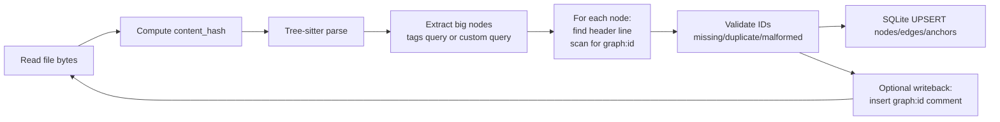

# Durable Declaration IDs via Inline Trailing Comments with Tree-sitter and SQLite

## Executive summary

**Date:** 2026-03-05 (America/New_York)

Embedding a durable `graph:id=…` on the **same line as a declaration header** (e.g., `class Foo:  # graph:id=...`) turns “entity identity” into an **explicit source-level fact**. The ID can be recovered on every reparse with a constant-time scan of the declaration’s header line (using Tree-sitter’s node start point/byte offsets), avoiding per-node database lookups or content diffs in the common case. Tree-sitter provides the necessary primitives: concrete syntax trees with named/anonymous node filtering for high-level structure, stable node ranges in bytes/points, incremental parsing via `Tree.edit` + parsing with `old_tree`, and `changed_ranges` to bound re-indexing. citeturn2view1turn2view2turn13view0turn4search19turn6view0

For multi-language indexing, you can use Tree-sitter queries (including the `queries/tags.scm` convention) to extract only “big/named” nodes (classes, functions, methods, imports; and for Markdown, sections/headings) and then attach durable IDs by scanning the **raw source line** at each definition’s start line. Tree-sitter’s code navigation docs standardize tag captures like `@definition.function` and `@name` and define a testing workflow (`tree-sitter tags`, `tree-sitter test`). citeturn3view1turn3view0

SQLite is a good persistence target for a local-first or per-repo index. Use UPSERT (`INSERT … ON CONFLICT DO UPDATE`) for idempotent updates and WAL mode for better read concurrency (many readers with a single writer). citeturn7search0turn7search3

A key new requirement you stated is **Markdown**: you want to track header sections and contents hierarchically. The actively maintained `tree-sitter-markdown` grammar under `tree-sitter-grammars` exposes node types like `document`, `section`, and `atx_heading` (plus nested `section`), which fits a hierarchical “heading → content blocks → subheadings” model well. citeturn10view0turn11view0

## Design concept and key decisions

### Core concept

You treat durable node IDs as **source annotations** that live on the declaration’s own header line:

- Python: `def f(...):  # graph:id=<id>`
- Markdown headings: `## Title <!-- graph:id=<id> -->` (HTML comment is the closest analog to “inline comment” in Markdown, and scanning raw text avoids relying on grammar specifics).

The extraction loop is:

1. Parse file with Tree-sitter.
2. Extract “big nodes” (definitions/sections/headings) with queries or named-node traversal.
3. For each extracted node, compute the start line (via `node.start_point`) and scan that line’s raw text for your `graph:id=…` marker.
4. Persist into SQLite keyed by the durable ID.

This leverages Tree-sitter’s support for inspecting node ranges as bytes and row/column points. citeturn2view1turn14view3

### What gets an embedded durable ID

**Recommended (durable IDs):**
- Python: module-level `class_definition`, `function_definition`; class members (methods) if you need them.
- Markdown: headings/sections (and optionally other block structures if needed).

**Not recommended (durable IDs):**
- Most expression/statement nodes, list items, inline spans, etc. Those are rarely worth lineage tracking and are highly volatile under edits.

Tree-sitter’s named-vs-anonymous node model supports this: you can ignore many token-level CST nodes and treat named nodes as an AST-like view using “named” traversal or query captures. citeturn2view1turn14view4

### Extraction: tags.scm vs custom queries

**Option A: Use `queries/tags.scm` for each grammar (preferred when available).**  
Tree-sitter’s code navigation system defines conventions like capturing `@definition.function` plus an inner `@name`, and expects tags queries to live at `queries/tags.scm` in the language repo; it also documents `tree-sitter tags` and `tree-sitter test` for validating these files. citeturn3view1turn3view0

**Option B: Maintain your own extraction queries per language (practical for Markdown).**  
Markdown grammars vary; some are not designed for fully correct structural semantics. The `tree-sitter-grammars/tree-sitter-markdown` README explicitly frames correctness limitations and highlights syntax-highlighting use as a main goal, so you should scope extraction to headings/sections where the grammar is reliable enough for your use case. citeturn10view0turn11view0

**Recommendation:** Start with tags.scm where it exists (Python). For Markdown, write a small dedicated query that captures section/heading nodes (or even just traverse `section` nodes), and compute hierarchy based on the grammar’s `section` nesting. citeturn3view1turn11view0

### Comment attachment strategy

**Decision:** Read IDs from raw text, not from comment nodes.

Even though many grammars treat whitespace/comments as “extras” that can appear between tokens without being mentioned in every production, relying on comment nodes across languages can be inconsistent. Tree-sitter documents the “extras” mechanism (commonly used for comments) and why it exists. citeturn3view3

**Recommendation:** Use stable Tree-sitter coordinates (`start_point.row` or `start_byte`) to locate the header line, then scan the raw line text for `graph:id=`. This is language-agnostic and fast.

## Parsing and extraction pipeline with inline IDs

### End-to-end pipeline



Tree-sitter parsing and incremental update capabilities: edit a syntax tree (`ts_tree_edit` / `Tree.edit`) and parse again with `old_tree` so unchanged structure can be reused; then use `changed_ranges` to focus subsequent work. citeturn2view2turn12view3turn13view0turn4search19

### Python/py-tree-sitter pseudocode

Below is “exact-enough” pseudocode aligned to the documented APIs:

- `Parser.parse(source, old_tree=None, encoding='utf8')` citeturn4search19
- `Tree.edit(...)` and `Tree.changed_ranges(new_tree)` citeturn13view0
- `QueryCursor.set_byte_range(start, end)` and `QueryCursor.matches(...)` citeturn6view0

```python
import os
import re
import sqlite3
from dataclasses import dataclass
from hashlib import sha256
from typing import Iterable, Optional, Tuple

from tree_sitter import Language, Parser, Query, QueryCursor

GRAPH_ID_RE = re.compile(r"\bgraph:id=([A-Za-z0-9_-]{8,64})\b")

@dataclass(frozen=True)
class TSInputEdit:
    start_byte: int
    old_end_byte: int
    new_end_byte: int
    start_point: Tuple[int, int]     # (row, col)
    old_end_point: Tuple[int, int]
    new_end_point: Tuple[int, int]

@dataclass
class ExtractedDef:
    kind: str                 # e.g., "class", "function", "method", "md_section"
    name: str                 # from @name capture or derived text
    start_byte: int
    end_byte: int
    start_row: int
    start_col: int
    header_line: str
    graph_id: Optional[str]   # from inline comment, if present

def hash_bytes(b: bytes) -> bytes:
    return sha256(b).digest()

def slice_line(src: bytes, row: int) -> str:
    """
    Return UTF-8 decoded line at 0-based row index.
    In production: precompute line start offsets for O(1) lookup.
    """
    lines = src.splitlines(keepends=False)
    return lines[row].decode("utf-8", errors="replace") if row < len(lines) else ""

def extract_defs_with_tags(tree, tags_query: Query, src: bytes) -> Iterable[ExtractedDef]:
    """
    Assumes tags query produces captures:
      - a container node captured as @definition.<kind>
      - a name node captured as @name
    See Tree-sitter code navigation conventions. (We typically keep only big nodes.)
    """
    cursor = QueryCursor(tags_query)
    # For a full-file run:
    matches = cursor.matches(tree.root_node)

    for pattern_index, capture_map in matches:
        # capture_map maps capture names to Node or list[Node] depending on bindings;
        # adapt as needed for your actual API return structure.
        # Here we assume at least: one definition node + one name node.
        def_node = None
        def_kind = None

        for cap_name, node in capture_map.items():
            if cap_name.startswith("definition."):
                def_node = node
                def_kind = cap_name.split(".", 1)[1]

        if def_node is None:
            continue

        name_node = capture_map.get("name")
        name_text = (name_node.text.decode("utf-8", errors="replace") if name_node else "")

        row, col = def_node.start_point
        header_line = slice_line(src, row)
        m = GRAPH_ID_RE.search(header_line)
        gid = m.group(1) if m else None

        yield ExtractedDef(
            kind=def_kind,
            name=name_text,
            start_byte=def_node.start_byte,
            end_byte=def_node.end_byte,
            start_row=row,
            start_col=col,
            header_line=header_line,
            graph_id=gid,
        )

def incremental_reindex(
    parser: Parser,
    old_tree,
    old_src: bytes,
    new_src: bytes,
    edit: TSInputEdit,
    query: Query,
) -> Tuple[object, list[Tuple[int, int]]]:
    """
    Returns new_tree and list of changed byte ranges.
    """
    # Keep the old tree in sync with the edit before reparsing.
    old_tree.edit(
        edit.start_byte, edit.old_end_byte, edit.new_end_byte,
        edit.start_point, edit.old_end_point, edit.new_end_point
    )

    new_tree = parser.parse(new_src, old_tree=old_tree)  # reuse unchanged structure
    changed = old_tree.changed_ranges(new_tree)          # list[Range] with start_byte/end_byte

    # Convert to byte tuples
    changed_byte_ranges = [(r.start_byte, r.end_byte) for r in changed]
    return new_tree, changed_byte_ranges

def extract_only_changed(tree, query: Query, src: bytes, changed_ranges: list[Tuple[int, int]]):
    cursor = QueryCursor(query)
    for start_b, end_b in changed_ranges:
        cursor.set_byte_range(start_b, end_b)
        for defn in extract_defs_with_tags(tree, query, src):
            # You may still want to filter by defn.start_byte/end_byte intersecting [start_b, end_b]
            yield defn
```

Key API semantics you should design around:

- Passing `old_tree` into parse enables reuse of unchanged parts, but only if you edited the old tree to match the source edit. citeturn2view2turn12view3  
- `Tree.changed_ranges(new_tree)` returns ranges where the tree’s hierarchical structure differs; returned ranges may be slightly larger than the exact diff. citeturn13view0  
- `QueryCursor.set_byte_range(start, end)` restricts execution to matches intersecting the byte range (not necessarily fully contained), which is useful for incremental updates. citeturn6view0  
- Non-local query patterns can disable optimizations that otherwise help ranged execution, so keep extraction queries “rooted” where possible. citeturn4search15

### Markdown extraction for hierarchical sections

#### Grammar choice

For your “heading sections + contents” goal, prefer `tree-sitter-grammars/tree-sitter-markdown`, whose node types include `document` containing `section`, and `section` containing `atx_heading` or `setext_heading` plus nested `section`. citeturn11view0turn10view0

This means you can represent the hierarchy as:

- Node = `section`
- Edge = `contains` from parent section to child section
- Edge/content = other block nodes within the section

#### Suggested Markdown query strategy

You have two workable approaches:

**Approach 1 (recommended): traverse `section` nodes directly**  
Because `section` is already present in the grammar and nests. citeturn11view0

**Approach 2: query headings and build hierarchy yourself**  
Useful if you switch to a different markdown grammar that lacks section nesting.

For inline durable IDs, use a Markdown-specific trailing marker, e.g.:

```markdown
## My Heading <!-- graph:id=abc123... -->
```

You still attach the ID by scanning the raw header line for `graph:id=`; the Tree-sitter start row gives you the correct line to scan. (You don’t need the grammar to parse the HTML comment to find the ID.)

## SQLite persistence design

### SQLite roles in this architecture

SQLite is responsible for:

- stable storage of durable nodes (entities)
- storage of edges (containment hierarchy, imports, references if you add them)
- storage of file snapshots (path, content hash, parse metadata)
- transactional batch updates

SQLite UPSERT provides idempotent update semantics for incremental re-indexing. citeturn7search0

Write-Ahead Logging (WAL) improves read concurrency and is commonly used for workloads with many readers; you should still architect around **a single writer** for best throughput. citeturn7search3turn7search7

### ID formats and tradeoffs

You need **durable IDs embedded in source** plus optional internal keys.

| Option | Example | Size | Pros | Cons | Recommendation |
|---|---|---:|---|---|---|
| UUIDv4 (random) | `550e8400-e29b-41d4-a716-446655440000` | 16 bytes | No coordination, easy generation | Not deterministic; must be embedded to persist | Great default for embedded `graph:id` |
| UUIDv5 (name-based) | `uuid5(namespace, name)` | 16 bytes | Deterministic from (namespace,name) | RFC 4122 uses SHA‑1; deterministic keys can leak semantics; renames change it | Use only for derived keys, not your durable “rename-safe” ID citeturn8search0 |
| SHA-256 hash | `sha256(...)` | 32 bytes | Standard, widely implemented | Longer; slower than some modern hashes | Good for file content hashes; OK for DB keys citeturn8search6turn8search2 |
| BLAKE3 hash | `blake3(...)` | 32 bytes (or truncated) | Designed for speed + parallelism | Another dependency; careful with truncation | Strong choice for large-scale content hashing, if you can depend on it citeturn8search5turn8search1 |
| Human-readable “symbol string” | `py:pkg.mod.Class#method(int,str)` | variable | Debuggable, can be indexed as TEXT | Not rename-safe; parsing required | Use as a *semantic key* column, not as permanent ID |

**Clear recommendation for your goal (#3 durable lineage IDs):**

- `graph:id` embedded in-line: **UUIDv4** (or ULID/UUIDv7 if you want sortability; you can still store as 16 bytes internally even if displayed). RFC 4122 defines UUIDs as 128-bit identifiers. citeturn8search0  
- Store `graph:id` in SQLite as **BLOB(16)** or as canonical TEXT; BLOB is smaller/faster, TEXT is more human-friendly.

### Schema design option A: relational “code index” schema

This schema keeps purpose-built tables and is usually the best balance for SQLite.

```sql
-- Versioning and metadata
CREATE TABLE meta (
  key TEXT PRIMARY KEY,
  value TEXT NOT NULL
);

-- Files tracked in the repo
CREATE TABLE file (
  file_id       BLOB PRIMARY KEY,            -- hash(repo_root + rel_path) or random stable file id
  rel_path      TEXT NOT NULL UNIQUE,
  language      TEXT NOT NULL,
  content_hash  BLOB NOT NULL,                -- sha256 or blake3(file bytes)
  size_bytes    INTEGER NOT NULL,
  mtime_ns      INTEGER NOT NULL
);

-- Durable entities (definitions/sections) keyed by embedded graph_id
CREATE TABLE entity (
  entity_id     BLOB PRIMARY KEY,             -- decoded graph:id (UUID bytes)
  kind          TEXT NOT NULL,                -- class/function/method/md_section/md_heading
  language      TEXT NOT NULL,
  name          TEXT NOT NULL,                -- last seen name/title
  semantic_key  TEXT NOT NULL,                -- debug + fallback matching
  flags         INTEGER NOT NULL DEFAULT 0,   -- bitmask (duplicate?, missing?, etc.)
  last_seen_at  INTEGER NOT NULL              -- epoch nanos or millis
);

-- Where an entity currently lives (anchor)
CREATE TABLE entity_anchor (
  entity_id     BLOB NOT NULL REFERENCES entity(entity_id),
  file_id       BLOB NOT NULL REFERENCES file(file_id),
  content_hash  BLOB NOT NULL,                -- tie anchor to file version
  start_byte    INTEGER NOT NULL,
  end_byte      INTEGER NOT NULL,
  start_row     INTEGER NOT NULL,
  start_col     INTEGER NOT NULL,
  header_row    INTEGER NOT NULL,             -- where graph:id was found
  PRIMARY KEY (entity_id, content_hash)
);

-- Edges among durable nodes (containment hierarchy etc.)
CREATE TABLE edge (
  src_entity_id BLOB NOT NULL REFERENCES entity(entity_id),
  edge_type     TEXT NOT NULL,                -- contains/imports/etc.
  dst_entity_id BLOB NOT NULL REFERENCES entity(entity_id),
  file_id       BLOB NULL REFERENCES file(file_id),
  PRIMARY KEY (src_entity_id, edge_type, dst_entity_id)
);

CREATE INDEX idx_entity_kind_lang ON entity(kind, language);
CREATE INDEX idx_anchor_file_version ON entity_anchor(file_id, content_hash, start_byte);
CREATE INDEX idx_edge_src_type ON edge(src_entity_id, edge_type);
```

For incremental updates, you UPSERT into `file`, `entity`, `entity_anchor`, and `edge` based on primary keys. SQLite documents UPSERT semantics as extending `INSERT` with `ON CONFLICT` behavior. citeturn7search0turn7search15

### Schema design option B: “property graph on SQL” schema

This is flexible and helps when you later add many node/edge kinds.

```sql
CREATE TABLE node (
  node_id     BLOB PRIMARY KEY,
  node_type   TEXT NOT NULL,           -- "entity", "file", ...
  props_json  TEXT NOT NULL            -- JSON blob
);

CREATE TABLE rel (
  src_id      BLOB NOT NULL REFERENCES node(node_id),
  rel_type    TEXT NOT NULL,           -- "contains", "defined_in", ...
  dst_id      BLOB NOT NULL REFERENCES node(node_id),
  props_json  TEXT NOT NULL,
  PRIMARY KEY (src_id, rel_type, dst_id)
);

CREATE INDEX idx_rel_dst_type ON rel(dst_id, rel_type);
```

If you use JSON properties, SQLite’s JSON functions/operators (JSON1) can help query and maintain JSON content. citeturn8search3

**Recommendation:** Start with Option A for performance and clarity. Option B becomes attractive once you have many heterogeneous node types and want schema agility.

### SQLite performance knobs and implications

**WAL mode** is the baseline recommendation for concurrent reads, and you should plan for one writer at a time. citeturn7search3turn7search7

Use PRAGMAs deliberately and benchmark:

- `PRAGMA journal_mode=WAL;` (concurrency) citeturn7search3  
- `PRAGMA synchronous=NORMAL;` (durability/perf tradeoff; benchmark in your environment) citeturn7search1  
- `PRAGMA foreign_keys=ON;` but note FK enforcement is per-connection, so set it on every connection you open. citeturn7search2turn7search17  
- Batch writes inside explicit transactions; use prepared statements and `executemany`.

## Incremental updates and concurrency

### Incremental parsing flow

Tree-sitter’s incremental update model has two key steps:

1. **Edit the old tree** to keep its node ranges aligned with the text edit (`ts_tree_edit` / `Tree.edit`). citeturn2view2turn13view0  
2. **Parse again** while passing the edited old tree so unchanged parts can be reused, saving time and memory (C API and bindings follow this pattern). citeturn2view2turn12view3turn4search19  

Then, use `changed_ranges` to focus extraction. `Tree.changed_ranges(new_tree)` returns ranges where the structural ancestor chain differs; ranges can be slightly larger than the exact edit. citeturn13view0

### Incremental extraction flow with QueryCursor ranges

For changed regions, using query range restriction is a primary optimization:

- `QueryCursor.set_byte_range(start, end)` restricts execution and returns matches that intersect the range. citeturn6view0  
- Keep your extraction query patterns “local/rooted” so range optimization is effective; non-local patterns can disable optimizations. citeturn4search15  

Practical incremental loop per file:

1. Apply edit to old tree (`Tree.edit`).
2. `new_tree = parser.parse(new_src, old_tree=old_tree)`.
3. `ranges = old_tree.changed_ranges(new_tree)`.
4. For each range, run extraction query with `QueryCursor.set_byte_range`.
5. For each matched definition, scan its header line for `graph:id=`.
6. UPSERT affected entities/anchors/edges only.

### Concurrency model with SQLite

**Parsing:** CPU-bound and embarrassingly parallel across files. Use multi-process workers (or threads if your binding and usage are safe), shard by language to reuse parser/query objects, and keep parsing isolated per worker.

**Tree thread-safety:** Tree-sitter syntax trees are not thread-safe; the C API explicitly provides `ts_tree_copy` for multi-thread usage and states you need a copy to use a tree on more than one thread at a time. citeturn1search3turn12view4

**SQLite writing:** Consider a single “DB writer” process/thread that:
- accepts extracted records from parsers
- writes in large transactions
- uses UPSERT for idempotence citeturn7search0

WAL supports concurrent readers during write activity (especially important if you want interactive queries while indexing). citeturn7search3

## Performance and cost models

### Cost components per file

Define:

- \( B \) = file bytes
- \( D \) = number of extracted durable nodes (definitions/sections)
- \( R \) = number of changed byte ranges from `changed_ranges`

Then approximate per-file time as:

\[
T \approx T_{\text{read}}(B) + T_{\text{parse}}(B) + \sum_{i=1}^{R} T_{\text{query}}(\text{range}_i) + T_{\text{scan}}(D) + T_{\text{db}}(D)
\]

Key observations grounded in API semantics:

- Incremental parsing can reuse unchanged structure, but only if edits are applied correctly. citeturn2view2turn12view3  
- `changed_ranges` bounds the work; ranges may be slightly larger than the edit. citeturn13view0  
- Ranged query execution depends on query shape; non-local patterns can reduce range optimization benefits. citeturn4search15  
- Header-line scanning is typically \(O(D \cdot L)\) where \(L\) is average header-line length (usually tiny vs parse/query).

### Example numeric estimates (illustrative)

These are **planning estimates**, not guarantees. They assume: SSD, warm filesystem cache, modern laptop/server core, and small extraction queries focused on big nodes.

| File size | Cold parse + full extract | Small edit (incremental) | Large reformat (many ranges) |
|---:|---:|---:|---:|
| 1–10 KB | ~0.5–2 ms | ~0.2–1 ms | ~0.6–2.5 ms |
| 10–100 KB | ~2–10 ms | ~0.5–4 ms | ~2–12 ms |
| 100 KB–1 MB | ~10–80 ms | ~2–20 ms | ~10–120 ms |

How to interpret:
- Inline ID scanning overhead is usually sub-millisecond even with dozens of defs; parse and query dominate.
- Large reformat is near “cold extract” because `changed_ranges` often covers much of the file and you end up re-querying most durable nodes.

### Per-repo scaling examples

Assume average 5 ms/file cold index and 8 workers:

- 10,000 files: ~50 seconds serial; ~6–8 seconds parallel (plus DB commit overhead).
- 1,000,000 files: ~5,000 seconds serial (~1.4 hours); ~10–20 minutes parallel (storage and DB will dominate).

These ranges depend heavily on language mix, file sizes, and how many nodes you persist; the measurement plan below is the way to make these real.

### Measurement methodology and microbenchmarks

Run microbenchmarks that isolate each component:

1. **Parse-only:** time `parser.parse(src)` over a corpus bucketed by size.
2. **Parse+query:** time parse + `QueryCursor.matches(root)` using your tags query.
3. **Parse+query+scan:** add header-line scan per match.
4. **SQLite write cost:** measure batch UPSERT of N entities/anchors/edges in one transaction.

Suggested commands/harness sketch:

- Use `python -m timeit` for tight loops with fixed inputs.
- Use `time.perf_counter()` in a harness that loads a representative corpus and reports percentiles (p50/p95/p99).
- For SQLite benchmarks, evaluate:
  - single-row UPSERT vs batched UPSERT in one transaction  
  - WAL vs rollback journal  
  - impact of indexes

SQLite references you should align with:
- UPSERT semantics: citeturn7search0  
- WAL behavior: citeturn7search3  
- PRAGMA catalog for tuning knobs: citeturn7search1  

## Failure modes, validation, security, and rollout plan

### Failure modes unique to inline IDs

| Failure mode | Cause | Detection | Recovery recommendation |
|---|---|---|---|
| Duplicate IDs | Copy/paste includes trailing `graph:id` | Same `entity_id` seen in multiple distinct definitions | Auto-fix tool: keep one owner, mint new IDs for others; writeback edits in a batch |
| Missing IDs | Legacy code not annotated; ID deleted by user | No match for `graph:id=` on header line | Policy: (a) annotate automatically on first index; or (b) mark “untracked until annotated” |
| Wrongly attached ID | Refactor moved comment to a different declaration line | `entity_id` now paired with incompatible `kind/language/semantic_key` | Treat as suspicious: mint new ID, optionally prompt; keep old ID in history table |
| Formatter moves or wraps comments | Auto-format changes header line layout | Scan fails or comment no longer on same line | Use alternate acceptable placements (immediately next line), or enforce “ID must be trailing on header line” and auto-repair |
| Multiline headers (esp. Python) | IDs on wrong line | Parse node start line differs from where user placed ID | Enforce: ID must be on the *first* header line; for multiline signatures, consider also accepting the line containing the colon `:` in Python (policy choice) |

Tree-sitter provides tools to unit test tag queries, which you should use to ensure your extraction is stable before you add ID writeback. citeturn3view0

Also: Tree-sitter query syntax explicitly supports matching `ERROR` and `MISSING` nodes to detect parse errors (useful for “don’t write back IDs when parse is broken”). citeturn1search5

### Validation and testing strategy

A practical testing stack:

- **Unit tests for extraction queries** using `tree-sitter test` with fixtures under `test/tags/` (per Tree-sitter’s tagging docs). citeturn3view0  
- **Property tests** for ID parsing/writing:
  - ID round-trip: annotate → parse → detect → same ID
  - insertion preserves syntax tree “big nodes” count (within expectations)
- **Duplicate-ID tests**: ensure copy/paste triggers detection and repair.

### Security and correctness

- **Untrusted repositories:** Tree-sitter grammars are native code libraries; parse untrusted code in a sandboxed worker process with resource limits.
- **Thread safety:** avoid sharing a `TSTree` across threads; copy the tree if you must query it from multiple threads. citeturn1search3turn12view4  
- **Writeback safety:** do not auto-write IDs if the file contains parse errors; detect error presence at root (`Node.has_error`) or via `(ERROR)`/`(MISSING)` queries. citeturn14view2turn1search5  

### Migration and versioning

Store at least:

- `schema_version` (SQLite schema)
- `id_format_version` (how you encode/decode `graph:id`)
- `query_bundle_hash` (hash of tags/extraction queries used)
- Tree-sitter language ABI/version metadata

Tree-sitter’s C API exposes language ABI compatibility constants and indicates `ts_parser_set_language` can fail when the language was generated by an incompatible CLI version; it also surfaces language metadata for semantic version signaling to warn about query incompatibility. citeturn12view4turn12view3

### Recommended implementation plan and effort

Milestones (order matters):

1. **Read-only indexer skeleton (2–4 person-days)**  
   Parse Python + Markdown, extract big nodes, scan inline IDs, persist to SQLite.
2. **Incremental parsing + ranged extraction (3–6 person-days)**  
   Integrate `Tree.edit`, parse with `old_tree`, use `changed_ranges`, and restrict queries via `QueryCursor.set_byte_range`. citeturn13view0turn6view0turn4search19turn2view2
3. **Writeback annotator (3–7 person-days)**  
   Insert missing IDs, detect duplicates, and run a repo-wide repair command.
4. **Hardening for scale (5–15 person-days)**  
   Worker sharding, batch DB writes, WAL configuration, and regression benchmarks. citeturn7search3turn7search0turn7search1
5. **Productionization (variable, 2–6 weeks)**  
   CI integration, migrations, error handling, policy controls for writeback, and audit logs.

**Main risks and mitigations:**
- Formatter/IDE behavior: mitigate via strict placement rules + repair tool.
- Markdown grammar variance: mitigate by pinning the grammar (`tree-sitter-grammars/tree-sitter-markdown`) and limiting scope to headings/sections. citeturn10view0turn11view0
- DB contention: mitigate with single-writer batching and WAL mode. citeturn7search3turn7search0

**Bottom-line recommendation:**  
For a multi-language codebase where rename/move lineage is a hard requirement, inline trailing IDs are the lowest-overhead “always recoverable” solution. Use Tree-sitter incremental parsing + changed-range bounded querying to keep updates fast, and keep SQLite as an append/update store with batched UPSERT transactions. citeturn2view2turn13view0turn6view0turn7search0