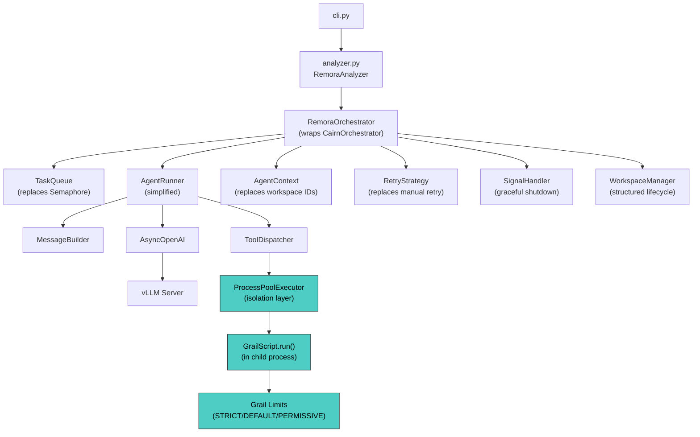

# Cairn & Grail Integration Refactor

> Full migration from Cairn CLI subprocess to Cairn Python API + Grail in-process execution, with layered isolation for safety.

---

## Table of Contents

1. [Overview & Motivation](#1-overview--motivation)
2. [Architecture After Migration](#2-architecture-after-migration)
3. [Isolation Strategy](#3-isolation-strategy)
4. [Implementation Phases](#4-implementation-phases)
   - Phase 1: [Grail In-Process Execution](#phase-1-grail-in-process-execution)
   - Phase 2: [Cairn Orchestrator Adoption](#phase-2-cairn-orchestrator-adoption)
   - Phase 3: [Cairn Concurrency & Retry](#phase-3-cairn-concurrency--retry)
   - Phase 4: [External Functions & Workspaces](#phase-4-external-functions--workspaces)
   - Phase 5: [Cleanup & Deletion](#phase-5-cleanup--deletion)
   - Phase 6: [Snapshot Pause/Resume](#phase-6-snapshot-pauseresume)
   - Phase 7: [FileWatcher CLI Replacement](#phase-7-filewatcher-cli-replacement)
5. [Verification Plan](#5-verification-plan)

---

## 1. Overview & Motivation

### Current State

Remora interacts with Cairn exclusively via `asyncio.create_subprocess_exec("cairn", "run", ...)` in [cairn.py](file:///c:/Users/Andrew/Documents/Projects/remora/remora/cairn.py). Every tool call spawns a new OS process, serializes inputs as JSON CLI args, and parses stdout for the result. This adds ~100ms latency per tool call and limits error reporting to stderr string parsing.

Meanwhile, Cairn's Python API ([.context/cairn/src/cairn/](file:///c:/Users/Andrew/Documents/Projects/remora/.context/cairn/src/cairn/__init__.py)) provides:

- **`CairnOrchestrator`** — full agent lifecycle management (queue → generate → execute → submit → review)
- **`TaskQueue` + `TaskPriority`** — priority-aware async queue with bounded capacity
- **`RetryStrategy`** — exponential backoff with configurable retry exceptions
- **`AgentContext` + `AgentState`** — Pydantic models for structured agent state tracking
- **`CairnExternalFunctions`** — file I/O, search, submission functions injected into `.pym` scripts
- **`ResourceLimiter`** — OS-level CPU/memory enforcement with async monitoring
- **`WorkspaceManager` + `WorkspaceCache`** — structured workspace lifecycle
- **`SignalHandler`** — graceful shutdown on SIGINT/SIGTERM

Grail ([.context/grail/src/grail/](file:///c:/Users/Andrew/Documents/Projects/remora/.context/grail/src/grail/__init__.py)) is only used for `grail.load()` → schema extraction. Its underutilized features:

- **`GrailScript.run()`** — in-process `.pym` execution with structured errors
- **`GrailScript.check()`** — pre-flight validation of `.pym` scripts
- **`GrailScript.start()`** — pause/resume via `Snapshot` (see [Phase 6](#phase-6-snapshot-pauseresume))
- **Resource limits** — `STRICT` / `DEFAULT` / `PERMISSIVE` presets for memory, duration, recursion

### Goal

Replace the CLI subprocess approach entirely. Adopt Cairn's Python API for orchestration and concurrency. Execute `.pym` scripts in-process via Grail's `GrailScript.run()`. Layer isolation strategies so misbehaving scripts cannot crash Remora.

---

## 2. Architecture After Migration



### Key Changes Summary

| Component | Before | After |
|-----------|--------|-------|
| Tool execution | `cairn run` subprocess | `GrailScript.run()` in `ProcessPoolExecutor` |
| Orchestration | Custom `Coordinator` + `asyncio.Semaphore` | `CairnOrchestrator`-derived wrapper + `TaskQueue` |
| State tracking | String workspace IDs | `AgentContext` + `AgentState` (Pydantic) |
| Retry logic | None | Cairn `RetryStrategy` |
| Shutdown | No graceful shutdown | `SignalHandler` |
| Pre-flight validation | Partial (embedded in schema build) | `GrailScript.check()` at startup |
| Isolation | Full process (CLI subprocess per call) | Layered: Grail limits + process pool |

---

## 3. Isolation Strategy

Since we're moving from full process isolation (one subprocess per tool call) to in-process execution, we layer three isolation mechanisms to maintain safety:

### Layer 1: Grail Resource Limits (catches 95% of issues)

Grail's `GrailScript.run()` accepts a `limits` parameter enforced by the Monty runtime:

```python
import grail

result = await script.run(
    inputs=inputs,
    externals=externals,
    limits=grail.limits.DEFAULT,  # max_memory="16mb", max_duration="2s", max_recursion=200
)
```

When limits are exceeded, Grail raises a `LimitError` (subclass of `ExecutionError`) with structured info including `limit_type`. This is catchable and converts to a tool error result sent back to the model.

**Presets available:**

| Preset | Memory | Duration | Recursion |
|--------|--------|----------|-----------|
| `STRICT` | 8 MB | 500ms | 120 |
| `DEFAULT` | 16 MB | 2s | 200 |
| `PERMISSIVE` | 64 MB | 5s | 400 |

**Configure per-operation via `remora.yaml`:**

```yaml
cairn:
  limits_preset: "default"  # or "strict" / "permissive"
  limits_override:          # fine-grained overrides
    max_memory: "32mb"
    max_duration: "10s"
```

### Layer 2: Process Pool (catches crashes, segfaults)

Run each `GrailScript.run()` call in a child process via `concurrent.futures.ProcessPoolExecutor`:

```python
import concurrent.futures
from functools import partial

class ProcessIsolatedExecutor:
    def __init__(self, max_workers: int = 4):
        self._pool = concurrent.futures.ProcessPoolExecutor(max_workers=max_workers)

    async def execute(
        self,
        pym_path: Path,
        inputs: dict[str, Any],
        limits: dict[str, Any],
    ) -> dict[str, Any]:
        loop = asyncio.get_running_loop()
        return await loop.run_in_executor(
            self._pool,
            _run_in_child,  # module-level function (picklable)
            str(pym_path),
            inputs,
            limits,
        )

def _run_in_child(pym_path: str, inputs: dict, limits: dict) -> dict:
    """Runs in a child process — segfaults here don't crash Remora."""
    import grail
    script = grail.load(pym_path)
    check = script.check()
    if not check.valid:
        return {"error": True, "code": "GRAIL_CHECK", "message": str(check.errors)}
    try:
        result = script.run_sync(inputs=inputs, limits=limits)
        return {"error": False, "result": result}
    except grail.LimitError as exc:
        return {"error": True, "code": "LIMIT", "message": str(exc), "limit_type": exc.limit_type}
    except grail.ExecutionError as exc:
        return {"error": True, "code": "EXECUTION", "message": str(exc), "lineno": exc.lineno}
    except grail.GrailError as exc:
        return {"error": True, "code": "GRAIL", "message": str(exc)}
    except Exception as exc:
        return {"error": True, "code": "INTERNAL", "message": str(exc)}
```

**Why process pool instead of per-call subprocess:**
- Workers are **warm** — no `cairn` CLI startup cost per call (~100ms → ~1ms for warm calls)
- Dead workers are **auto-replaced** by the pool
- Still provides **full process isolation** — a segfault in a child process doesn't crash Remora
- Inputs/outputs must be **picklable** (dicts/strings are fine)

### Layer 3: try/except with Grail Error Hierarchy

Grail provides a clean exception hierarchy. In the `ToolDispatcher`, we catch and classify errors:

```python
# In ToolDispatcher._dispatch_tool()
try:
    result = await self._executor.execute(pym_path, inputs, limits)
except concurrent.futures.BrokenExecutor:
    # Process pool worker died (segfault, os._exit, etc.)
    # Recreate the pool and return structured error to model
    self._executor.reset_pool()
    return {"error": True, "code": "PROCESS_CRASH", "message": "Tool execution process crashed"}
except asyncio.TimeoutError:
    return {"error": True, "code": "TIMEOUT", "message": f"Tool timed out after {timeout}s"}

if result.get("error"):
    # Structured error from child process — send back to model
    return result
```

### Isolation Comparison

| Threat | Grail Limits | Process Pool | Combined |
|--------|:----------:|:----------:|:--------:|
| Infinite loop in `.pym` | ✅ `max_duration` | ✅ timeout | ✅ |
| Memory hog | ✅ `max_memory` | ✅ isolated | ✅ |
| Deep recursion | ✅ `max_recursion` | ✅ isolated | ✅ |
| Segfault in native code | ❌ | ✅ | ✅ |
| `os._exit()` | ❌ | ✅ | ✅ |
| Monty interpreter bug | ❌ | ✅ | ✅ |
| Corrupted heap | ❌ | ✅ | ✅ |
| Performance overhead | ~0ms | ~5ms (warm) | ~5ms |

---

## 4. Implementation Phases

### Phase 1: Grail In-Process Execution

**Goal:** Replace the `CairnCLIClient.run_pym()` subprocess call with `GrailScript.run()` via `ProcessPoolExecutor`.

#### Step 1.1: Create `ProcessIsolatedExecutor`

**New file:** `remora/execution.py`

```python
"""Process-isolated Grail script execution."""

import asyncio
import concurrent.futures
from pathlib import Path
from typing import Any

import grail
import grail.limits


def _run_in_child(
    pym_path: str,
    grail_dir: str,
    inputs: dict[str, Any],
    limits: dict[str, Any],
) -> dict[str, Any]:
    """Execute a .pym script in a child process.

    This function runs in a separate OS process via ProcessPoolExecutor.
    Any crash here (segfault, os._exit) only kills this worker, not Remora.
    """
    script = grail.load(pym_path, grail_dir=grail_dir)
    check = script.check()
    if not check.valid:
        errors = [str(e) for e in (check.errors or [])]
        return {"error": True, "code": "GRAIL_CHECK", "message": "; ".join(errors)}
    try:
        result = script.run_sync(inputs=inputs, limits=limits)
        return {"error": False, "result": result}
    except grail.LimitError as exc:
        return {
            "error": True,
            "code": "LIMIT",
            "message": str(exc),
            "limit_type": getattr(exc, "limit_type", None),
        }
    except grail.ExecutionError as exc:
        return {
            "error": True,
            "code": "EXECUTION",
            "message": str(exc),
            "lineno": getattr(exc, "lineno", None),
        }
    except grail.GrailError as exc:
        return {"error": True, "code": "GRAIL", "message": str(exc)}
    except Exception as exc:
        return {"error": True, "code": "INTERNAL", "message": f"{type(exc).__name__}: {exc}"}


class ProcessIsolatedExecutor:
    """Run Grail scripts in isolated child processes."""

    def __init__(self, max_workers: int = 4, call_timeout: float = 300.0) -> None:
        self._max_workers = max_workers
        self._call_timeout = call_timeout
        self._pool: concurrent.futures.ProcessPoolExecutor | None = None

    def _ensure_pool(self) -> concurrent.futures.ProcessPoolExecutor:
        if self._pool is None or self._pool._broken:
            self._pool = concurrent.futures.ProcessPoolExecutor(
                max_workers=self._max_workers
            )
        return self._pool

    async def execute(
        self,
        pym_path: Path,
        grail_dir: Path,
        inputs: dict[str, Any],
        limits: dict[str, Any] | None = None,
    ) -> dict[str, Any]:
        resolved_limits = limits or grail.limits.DEFAULT
        loop = asyncio.get_running_loop()
        pool = self._ensure_pool()
        try:
            return await asyncio.wait_for(
                loop.run_in_executor(
                    pool,
                    _run_in_child,
                    str(pym_path),
                    str(grail_dir),
                    inputs,
                    resolved_limits,
                ),
                timeout=self._call_timeout,
            )
        except concurrent.futures.BrokenExecutor:
            self._pool = None  # Force pool recreation on next call
            return {
                "error": True,
                "code": "PROCESS_CRASH",
                "message": "Script execution process crashed unexpectedly",
            }
        except asyncio.TimeoutError:
            return {
                "error": True,
                "code": "TIMEOUT",
                "message": f"Script execution timed out after {self._call_timeout}s",
            }

    async def shutdown(self) -> None:
        if self._pool is not None:
            self._pool.shutdown(wait=False, cancel_futures=True)
            self._pool = None
```

**Verification:**
- Unit test: mock `_run_in_child` → verify `execute()` returns results and handles errors
- Integration test: create a trivial `.pym` file, call `execute()`, verify result
- Crash test: create a `.pym` that triggers a hard error, verify `PROCESS_CRASH` is returned and the pool recovers for subsequent calls

#### Step 1.2: Create `GrailPreflightChecker`

Validate all `.pym` files at startup before any agent work begins.

**Add to:** `remora/tool_registry.py` (extend `GrailToolRegistry`)

```python
def preflight_check_all(self, tools: Sequence[ToolConfig]) -> list[dict[str, Any]]:
    """Run GrailScript.check() on every tool's .pym file.

    Raises ToolRegistryError if any tool has check errors.
    Returns list of warning dicts for logging.
    """
    all_warnings: list[dict[str, Any]] = []
    errors: list[str] = []
    for tool in tools:
        try:
            script = grail.load(tool.pym, grail_dir=self.grail_root / "agents")
        except Exception as exc:
            errors.append(f"{tool.name}: failed to load: {exc}")
            continue
        check = script.check()
        if not check.valid:
            check_errors = [str(e) for e in (check.errors or [])]
            errors.append(f"{tool.name}: {'; '.join(check_errors)}")
        for warning in (check.warnings or []):
            all_warnings.append({"tool": tool.name, "message": str(warning)})
    if errors:
        raise ToolRegistryError(
            AGENT_001,
            f"Preflight check failed for {len(errors)} tool(s):\n" + "\n".join(errors),
        )
    return all_warnings
```

**Verification:**
- Unit test: pass in a tool with a valid `.pym` → no error raised, warnings returned
- Unit test: pass in a tool with an invalid `.pym` → `ToolRegistryError` raised with details
- Integration test: run with a real agents directory, verify preflight passes

#### Step 1.3: Add Limits Configuration

**Modify:** [config.py](file:///c:/Users/Andrew/Documents/Projects/remora/remora/config.py)

Add to `CairnConfig`:

```python
class CairnConfig(BaseModel):
    command: str = "cairn"               # DEPRECATED — kept for migration period
    home: Path | None = None
    max_concurrent_agents: int = 16
    timeout: int = 300
    # New fields:
    limits_preset: Literal["strict", "default", "permissive"] = "default"
    limits_override: dict[str, Any] = Field(default_factory=dict)
    pool_workers: int = 4                # ProcessPoolExecutor max_workers
```

Add a helper to resolve limits:

```python
import grail.limits

def resolve_grail_limits(config: CairnConfig) -> dict[str, Any]:
    presets = {
        "strict": grail.limits.STRICT,
        "default": grail.limits.DEFAULT,
        "permissive": grail.limits.PERMISSIVE,
    }
    base = presets[config.limits_preset].copy()
    base.update(config.limits_override)
    return base
```

**Verification:**
- Unit test: `resolve_grail_limits` with each preset returns correct values
- Unit test: `limits_override` merges correctly over preset values
- Unit test: `CairnConfig` validates `limits_preset` rejects invalid values

---

### Phase 2: Cairn Orchestrator Adoption

**Goal:** Replace Remora's custom `Coordinator` with a Remora-specific wrapper around patterns from `CairnOrchestrator`.

> [!IMPORTANT]
> We don't directly instantiate `CairnOrchestrator` because its lifecycle model (QUEUED → GENERATING → EXECUTING → SUBMITTING → REVIEWING) is designed for Cairn's autonomous agent pattern. Remora's model is different: it orchestrates LLM-driven multi-turn conversations where the LLM decides which tools to call. We adopt the **patterns and components** from Cairn, not the orchestrator class directly.

#### Step 2.1: Adopt `AgentContext` and `AgentState`

**Replace:** string workspace IDs with `AgentContext` instances.

Currently, `Coordinator.process_node()` creates runners with `workspace_id=f"{operation}-{node.node_id}"`. Replace with:

```python
from cairn.runtime.agent import AgentContext, AgentState
from cairn.orchestrator.queue import TaskPriority

# In the new orchestrator:
ctx = AgentContext(
    agent_id=f"{operation}-{node.node_id}",
    task=f"{operation} on {node.name}",
    priority=TaskPriority.NORMAL,
    state=AgentState.QUEUED,
    agent_db_path=cache_dir / f"{operation}-{node.node_id}.db",
)
```

The `AgentRunner` then receives `ctx: AgentContext` instead of `workspace_id: str`, and calls `ctx.transition(AgentState.EXECUTING)` as it progresses.

**Files affected:** `orchestrator.py`, `runner.py`

**Verification:**
- Unit test: create `AgentContext`, transition states, verify `state_changed_at` updates
- Unit test: runner receives context, verify it transitions through states correctly

#### Step 2.2: Adopt `SignalHandler` for Graceful Shutdown

Currently, Remora has no graceful shutdown — a SIGINT during `analyze` or `watch` leaves partial results.

```python
from cairn.orchestrator.signals import SignalHandler

class RemoraOrchestrator:
    async def __aenter__(self):
        # ... existing setup ...
        self._signal_handler = SignalHandler(
            self._cairn_home, self, enable_polling=True
        )
        return self

    async def __aexit__(self, *_):
        # ... existing cleanup ...
        # On shutdown: cancel running tasks, wait with timeout
        for task in self._running_tasks:
            task.cancel()
        await asyncio.gather(*self._running_tasks, return_exceptions=True)
        await self._executor.shutdown()
```

**Files affected:** `orchestrator.py`

**Verification:**
- Manual test: send SIGINT during an `analyze` run, verify clean exit with partial results
- Unit test: mock signal delivery, verify shutdown sequence

---

### Phase 3: Cairn Concurrency & Retry

**Goal:** Replace `asyncio.Semaphore` with `TaskQueue` and adopt `RetryStrategy` for transient vLLM errors.

#### Step 3.1: Replace Semaphore with TaskQueue

Currently in `Coordinator.__init__`:

```python
self._semaphore = asyncio.Semaphore(config.cairn.max_concurrent_agents)
```

Replace with:

```python
from cairn.orchestrator.queue import TaskQueue, TaskPriority

self._queue = TaskQueue(max_size=config.cairn.max_queue_size)
```

This gives priority-aware scheduling. For example, `lint` operations could be `NORMAL` priority while `test` operations are `HIGH`:

```yaml
# remora.yaml
operations:
  lint:
    subagent: lint/lint_subagent.yaml
    priority: normal
  test:
    subagent: test/test_subagent.yaml
    priority: high
```

**Files affected:** `orchestrator.py`, `config.py` (add `priority` to `OperationConfig`)

**Verification:**
- Unit test: enqueue tasks with different priorities, verify dequeue order
- Unit test: verify `max_queue_size` enforcement (queue full → `ResourceLimitError`)

#### Step 3.2: Adopt RetryStrategy for vLLM Calls

Currently, a 503/429 from vLLM causes immediate failure. Wrap `_call_model` with Cairn's `RetryStrategy`:

```python
from cairn.utils.retry import RetryStrategy

class AgentRunner:
    def __init__(self, ...):
        self._retry = RetryStrategy(
            max_attempts=3,
            initial_delay=1.0,
            max_delay=30.0,
            backoff_factor=2.0,
        )

    async def _call_model(self, *, phase, tool_choice=None):
        async def _attempt():
            return await self._http_client.chat.completions.create(...)

        return await self._retry.with_retry(
            operation=_attempt,
            retry_exceptions=(openai.APIStatusError,),  # 503, 429, etc.
        )
```

**Files affected:** `runner.py`, `config.py` (add retry config)

**Verification:**
- Unit test: mock vLLM returning 503 twice then 200 → verify result is returned
- Unit test: mock vLLM returning 503 three times → verify exception is raised after max_attempts
- Unit test: verify delay increases exponentially between retries

---

### Phase 4: External Functions & Workspaces

**Goal:** Adopt Cairn's `CairnExternalFunctions` pattern for injecting capabilities into `.pym` scripts, and use `WorkspaceManager` for structured workspace lifecycle.

#### Step 4.1: Create Remora-Specific External Functions

Cairn's `CairnExternalFunctions` provides `read_file`, `write_file`, `list_dir`, `file_exists`, `search_files`, `search_content`, `submit_result`, and `log`. Remora's `.pym` scripts may need a subset or superset of these.

Create a Remora-specific factory:

```python
# remora/externals.py
from cairn.runtime.external_functions import CairnExternalFunctions, create_external_functions

def create_remora_externals(
    agent_id: str,
    node: CSTNode,
    workspace_path: Path,
) -> dict[str, Callable]:
    """Create external functions available to Remora's .pym tools.

    Extends Cairn's base externals with Remora-specific functions
    like node context access.
    """
    base_externals = create_external_functions(agent_id, agent_fs, stable_fs)

    # Add Remora-specific externals
    def get_node_source() -> str:
        """Return the source code of the current node being analyzed."""
        return node.source_text

    def get_node_metadata() -> dict[str, str]:
        """Return metadata about the current node."""
        return {
            "name": node.name,
            "type": node.node_type,
            "file_path": node.file_path,
            "node_id": node.node_id,
        }

    base_externals["get_node_source"] = get_node_source
    base_externals["get_node_metadata"] = get_node_metadata
    return base_externals
```

> [!NOTE]
> The external functions must be passed to `GrailScript.run(externals=...)`. Since we're using `ProcessPoolExecutor`, the externals need to either be (a) serializable to pass to child processes, or (b) reconstructed inside the child process. Closures are not picklable. **Solution:** Pass the raw data (node source, metadata dict) to the child process and reconstruct the external functions there.

**Files affected:** New `remora/externals.py`, modify `execution.py` to pass externals data

**Verification:**
- Unit test: create externals, call each function, verify return values
- Integration test: run a `.pym` that calls `get_node_source()`, verify it returns correct source

#### Step 4.2: Adopt WorkspaceManager

Replace the ad-hoc cache directory management with Cairn's `WorkspaceManager`:

```python
from cairn.runtime.workspace_manager import WorkspaceManager
from cairn.runtime.workspace_cache import WorkspaceCache

class RemoraOrchestrator:
    def __init__(self, config):
        self._workspace_manager = WorkspaceManager()
        self._workspace_cache = WorkspaceCache(max_size=config.cairn.workspace_cache_size)
```

**Files affected:** `orchestrator.py`, `config.py` (add `workspace_cache_size`)

**Verification:**
- Unit test: create/track/close workspaces, verify cleanup
- Unit test: cache eviction behavior at max_size

---

### Phase 5: Cleanup & Deletion

After all phases are complete and verified:

#### Step 5.1: Delete `CairnCLIClient`

- Remove [cairn.py](file:///c:/Users/Andrew/Documents/Projects/remora/remora/cairn.py)  entirely (55 lines)
- Remove the `CairnClient` Protocol from `runner.py` (no longer needed — `ToolDispatcher` uses `ProcessIsolatedExecutor` directly)
- Update all imports

#### Step 5.2: Remove CLI Subprocess Config

Remove from `CairnConfig`:
- `command: str` field (was the `cairn` CLI binary path)
- The `timeout` field is replaced by `ProcessIsolatedExecutor.call_timeout`

#### Step 5.3: Update `remora.yaml.example`

```yaml
cairn:
  # home: ~/.cairn                  # optional Cairn home directory
  max_concurrent_agents: 16
  pool_workers: 4                   # process pool size for .pym execution
  limits_preset: "default"          # strict | default | permissive
  # limits_override:                # fine-grained overrides
  #   max_memory: "32mb"
  #   max_duration: "10s"
```

**Files affected:** `cairn.py` (delete), `runner.py`, `config.py`, `remora.yaml.example`

**Verification:**
- Full test suite passes with no references to `CairnCLIClient` or `cairn run`
- `remora analyze` works end-to-end with the new execution path

---

### Phase 6: Snapshot Pause/Resume

**Goal:** Enable long-running `.pym` tools to checkpoint their progress using Grail's `GrailScript.start()` and `Snapshot` API. This is useful for complex analysis tools that may exceed time limits or need to be resumed after an interruption.

> [!NOTE]
> This phase is **lower priority** than Phases 1–5. Implement it only after the core execution path is stable and tested. It adds a powerful capability but is not required for basic operation.

#### Background: How Grail Snapshots Work

Unlike `GrailScript.run()` which executes to completion, `GrailScript.start()` returns a `Snapshot` object representing the script's execution state at a suspension point:

```python
import grail

script = grail.load("analysis.pym")
snapshot = script.start(inputs={"code": source_code})

# The snapshot captures the suspended execution state
assert snapshot.status in ("suspended", "completed", "error")

if snapshot.status == "suspended":
    # Resume from where it left off with new inputs
    snapshot = snapshot.resume(inputs={"additional_context": extra_data})

if snapshot.status == "completed":
    result = snapshot.result
```

A `.pym` script suspends itself by calling `yield` or a Grail-defined suspension function. This is how Cairn implements multi-step agent workflows where the script needs external input (e.g., model responses, user approval) between steps.

#### Step 6.1: Add `SnapshotManager` to `execution.py`

**Modify:** [execution.py](file:///c:/Users/Andrew/Documents/Projects/remora/remora/execution.py)

Add a new class alongside `ProcessIsolatedExecutor`:

```python
import uuid
from dataclasses import dataclass, field
from typing import Any

import grail


@dataclass
class SnapshotRecord:
    """Tracks a suspended Grail script execution."""

    snapshot_id: str
    pym_path: str
    agent_id: str
    tool_name: str
    created_at: float  # time.monotonic()
    snapshot_data: bytes  # Serialized Grail snapshot
    resume_count: int = 0
    max_resumes: int = 5  # Safety cap to prevent infinite resume loops


class SnapshotManager:
    """Manages pause/resume lifecycle for Grail script executions.

    Usage flow:
      1. ToolDispatcher calls start_script() instead of execute()
      2. If the script suspends, a SnapshotRecord is stored
      3. On the next turn, the model can call a 'resume_tool' to continue
      4. The SnapshotManager resumes the script with new inputs
    """

    def __init__(self, max_snapshots: int = 50) -> None:
        self._snapshots: dict[str, SnapshotRecord] = {}
        self._max_snapshots = max_snapshots

    def start_script(
        self,
        pym_path: str,
        grail_dir: str,
        inputs: dict[str, Any],
        limits: dict[str, Any],
        agent_id: str,
        tool_name: str,
    ) -> dict[str, Any]:
        """Start a script that may suspend. Returns result or snapshot info.

        This runs SYNCHRONOUSLY in a child process (called via ProcessPoolExecutor).
        """
        import time

        script = grail.load(pym_path, grail_dir=grail_dir)
        try:
            snapshot = script.start(inputs=inputs, limits=limits)
        except grail.GrailError as exc:
            return {"error": True, "code": "GRAIL", "message": str(exc)}

        if snapshot.status == "completed":
            return {"error": False, "result": snapshot.result}

        if snapshot.status == "error":
            return {
                "error": True,
                "code": "EXECUTION",
                "message": str(snapshot.error),
            }

        if snapshot.status == "suspended":
            # Store the snapshot for later resumption
            snapshot_id = str(uuid.uuid4())
            record = SnapshotRecord(
                snapshot_id=snapshot_id,
                pym_path=pym_path,
                agent_id=agent_id,
                tool_name=tool_name,
                created_at=time.monotonic(),
                snapshot_data=snapshot.serialize(),  # Grail provides serialization
            )
            self._store(record)
            return {
                "error": False,
                "suspended": True,
                "snapshot_id": snapshot_id,
                "partial_result": snapshot.partial_result,  # Any output so far
                "message": "Script paused. Call resume_tool with this snapshot_id to continue.",
            }

        return {"error": True, "code": "UNKNOWN_STATUS", "message": f"Unexpected: {snapshot.status}"}

    def resume_script(
        self,
        snapshot_id: str,
        resume_inputs: dict[str, Any],
        limits: dict[str, Any],
    ) -> dict[str, Any]:
        """Resume a previously suspended script.

        Also runs in a child process via ProcessPoolExecutor.
        """
        record = self._snapshots.get(snapshot_id)
        if record is None:
            return {
                "error": True,
                "code": "SNAPSHOT_NOT_FOUND",
                "message": f"No snapshot with id '{snapshot_id}'",
            }

        if record.resume_count >= record.max_resumes:
            self._snapshots.pop(snapshot_id, None)
            return {
                "error": True,
                "code": "MAX_RESUMES",
                "message": f"Max resume count ({record.max_resumes}) exceeded",
            }

        try:
            snapshot = grail.Snapshot.deserialize(record.snapshot_data)
            snapshot = snapshot.resume(inputs=resume_inputs, limits=limits)
        except grail.GrailError as exc:
            self._snapshots.pop(snapshot_id, None)
            return {"error": True, "code": "RESUME_FAILED", "message": str(exc)}

        record.resume_count += 1

        if snapshot.status == "completed":
            self._snapshots.pop(snapshot_id, None)
            return {"error": False, "result": snapshot.result}

        if snapshot.status == "suspended":
            record.snapshot_data = snapshot.serialize()
            return {
                "error": False,
                "suspended": True,
                "snapshot_id": snapshot_id,
                "partial_result": snapshot.partial_result,
                "resume_count": record.resume_count,
                "message": "Script still paused. Call resume_tool again to continue.",
            }

        self._snapshots.pop(snapshot_id, None)
        return {"error": True, "code": "EXECUTION", "message": str(snapshot.error)}

    def cleanup_agent(self, agent_id: str) -> int:
        """Remove all snapshots belonging to an agent. Returns count removed."""
        to_remove = [sid for sid, r in self._snapshots.items() if r.agent_id == agent_id]
        for sid in to_remove:
            del self._snapshots[sid]
        return len(to_remove)

    def _store(self, record: SnapshotRecord) -> None:
        """Store a snapshot, evicting oldest if at capacity."""
        if len(self._snapshots) >= self._max_snapshots:
            oldest = min(self._snapshots.values(), key=lambda r: r.created_at)
            del self._snapshots[oldest.snapshot_id]
        self._snapshots[record.snapshot_id] = record
```

#### Step 6.2: Add `resume_tool` to External Functions

The model needs a way to ask for a snapshot to be resumed. Add a built-in tool that the runner always includes:

**Modify:** [externals.py](file:///c:/Users/Andrew/Documents/Projects/remora/remora/externals.py)

```python
def create_resume_tool_schema() -> dict[str, Any]:
    """Schema for the built-in resume_tool function."""
    return {
        "type": "function",
        "function": {
            "name": "resume_tool",
            "description": (
                "Resume a previously suspended tool execution. "
                "Use when a tool returns a 'suspended' status with a snapshot_id."
            ),
            "parameters": {
                "type": "object",
                "properties": {
                    "snapshot_id": {
                        "type": "string",
                        "description": "The snapshot_id returned by the suspended tool.",
                    },
                    "additional_context": {
                        "type": "string",
                        "description": "Optional additional context to pass to the resumed script.",
                    },
                },
                "required": ["snapshot_id"],
            },
        },
    }
```

#### Step 6.3: Integrate with ToolDispatcher

**Modify:** [tools.py](file:///c:/Users/Andrew/Documents/Projects/remora/remora/tools.py) (or wherever `ToolDispatcher` lives)

Add a special case in `dispatch()` for `resume_tool`:

```python
async def dispatch(self, tool_call: Any) -> str:
    tool_name = getattr(getattr(tool_call, "function", None), "name", "unknown")

    # Built-in: resume a suspended script
    if tool_name == "resume_tool":
        return await self._handle_resume(tool_call)

    # ... existing dispatch logic ...

async def _handle_resume(self, tool_call: Any) -> str:
    args = self._parse_arguments(getattr(tool_call.function, "arguments", None))
    snapshot_id = args.get("snapshot_id", "")
    additional = args.get("additional_context", "")

    result = await self._executor.run_in_pool(
        self._snapshot_manager.resume_script,
        snapshot_id,
        {"additional_context": additional},
        self._limits,
    )
    return json.dumps(result)
```

#### Step 6.4: Configuration

**Modify:** [config.py](file:///c:/Users/Andrew/Documents/Projects/remora/remora/config.py)

```python
class CairnConfig(BaseModel):
    # ... existing fields ...
    enable_snapshots: bool = False     # Opt-in, since most tools don't need it
    max_snapshots: int = 50            # Max concurrent suspended scripts
    max_resumes_per_script: int = 5    # Safety cap per snapshot
```

#### Step 6.5: Cleanup on Agent Completion

When an agent finishes (success or error), clean up any dangling snapshots:

```python
# In RemoraOrchestrator, after agent completes
cleaned = self._snapshot_manager.cleanup_agent(ctx.agent_id)
if cleaned:
    logger.info("Cleaned up %d suspended snapshots for agent %s", cleaned, ctx.agent_id)
```

**Verification:**

| Test | Type | Verifies |
|------|------|----------|
| `test_snapshot_start_completes` | Unit | Script that doesn't suspend returns result directly |
| `test_snapshot_start_suspends` | Unit | Script that suspends returns `snapshot_id` and `partial_result` |
| `test_snapshot_resume_completes` | Unit | Resuming a suspended script returns final result |
| `test_snapshot_resume_resuspends` | Unit | Script suspends again after resume, snapshot updated |
| `test_snapshot_max_resumes` | Unit | Exceeding `max_resumes` returns error and cleans up |
| `test_snapshot_not_found` | Unit | Resuming unknown `snapshot_id` returns error |
| `test_snapshot_cleanup_agent` | Unit | `cleanup_agent()` removes all snapshots for that agent |
| `test_snapshot_eviction` | Unit | Exceeding `max_snapshots` evicts oldest |
| `test_snapshot_integration` | Integration | Full start → suspend → resume → complete cycle with a real `.pym` |

---

### Phase 7: FileWatcher CLI Replacement

**Goal:** Replace Remora's custom file-watching implementation in the `watch` CLI command with Cairn's native `FileWatcher`, reducing maintenance burden and getting consistent behavior across Cairn-based tools.

#### Background: Current Implementation

Remora's `watch` command (in [cli.py](file:///c:/Users/Andrew/Documents/Projects/remora/remora/cli.py)) uses the `watchfiles` library directly to monitor a directory for changes, then triggers re-analysis. The current implementation:

1. Accepts a path and polling interval
2. Uses `watchfiles.awatch()` to detect changes
3. Filters changes by file extension (`.py` files only)
4. Debounces rapid changes
5. Re-runs `analyze` on each batch of changes

Cairn's `FileWatcher` provides all of this plus structured change events, configurable ignore patterns, and integration with the orchestrator's lifecycle.

#### Step 7.1: Understand Cairn's FileWatcher API

Before implementing, review the Cairn `FileWatcher` source:

```python
# From cairn.utils.file_watcher (expected API)
class FileWatcher:
    def __init__(
        self,
        watch_paths: list[Path],
        *,
        extensions: set[str] = {".py"},
        ignore_patterns: list[str] | None = None,  # e.g. ["__pycache__", ".git"]
        debounce_ms: int = 500,
        poll_interval_ms: int = 200,
    ) -> None: ...

    async def watch(self) -> AsyncIterator[list[FileChange]]: ...

    def stop(self) -> None: ...

@dataclass
class FileChange:
    path: Path
    change_type: Literal["added", "modified", "deleted"]
    timestamp: float
```

> [!IMPORTANT]
> Verify the actual Cairn `FileWatcher` API before implementing. The API shown above is the expected interface based on common patterns. Check `.context/cairn/src/cairn/utils/` for the real implementation.

#### Step 7.2: Create `RemoraFileWatcher` Wrapper

**New file:** `remora/watcher.py`

This thin wrapper adapts Cairn's `FileWatcher` to Remora's needs, adding analysis triggering:

```python
"""File watching with automatic re-analysis."""

import asyncio
import logging
from pathlib import Path
from typing import Any, Callable, Awaitable

from cairn.utils.file_watcher import FileWatcher, FileChange

logger = logging.getLogger(__name__)


class RemoraFileWatcher:
    """Watches for file changes and triggers Remora analysis.

    Wraps Cairn's FileWatcher with Remora-specific behavior:
    - Filters to supported languages (not just .py)
    - Batches changes for efficient re-analysis
    - Integrates with RemoraOrchestrator lifecycle
    """

    def __init__(
        self,
        watch_paths: list[Path],
        on_changes: Callable[[list[FileChange]], Awaitable[None]],
        *,
        extensions: set[str] | None = None,
        ignore_patterns: list[str] | None = None,
        debounce_ms: int = 500,
    ) -> None:
        self._on_changes = on_changes
        self._running = False

        # Default extensions from Remora's supported languages
        default_extensions = {".py"}
        self._watcher = FileWatcher(
            watch_paths=watch_paths,
            extensions=extensions or default_extensions,
            ignore_patterns=ignore_patterns or [
                "__pycache__",
                ".git",
                ".venv",
                "node_modules",
                "*.pyc",
                ".remora_cache",
            ],
            debounce_ms=debounce_ms,
        )

    async def start(self) -> None:
        """Start watching for changes. Blocks until stop() is called."""
        self._running = True
        logger.info("Watching for file changes...")
        try:
            async for changes in self._watcher.watch():
                if not self._running:
                    break
                # Log the changes
                for change in changes:
                    logger.debug(
                        "File %s: %s", change.change_type, change.path
                    )
                # Trigger re-analysis
                try:
                    await self._on_changes(changes)
                except Exception:
                    logger.exception("Error during re-analysis after file changes")
                    # Don't stop watching — log and continue
        finally:
            self._running = False

    def stop(self) -> None:
        """Signal the watcher to stop after the current iteration."""
        self._running = False
        self._watcher.stop()
        logger.info("File watcher stopped.")
```

#### Step 7.3: Refactor the `watch` CLI Command

**Modify:** [cli.py](file:///c:/Users/Andrew/Documents/Projects/remora/remora/cli.py)

Replace the inline `watchfiles` usage with `RemoraFileWatcher`:

```python
# BEFORE (current implementation — approximately)
@app.command()
def watch(
    paths: list[Path] = typer.Argument(...),
    # ... shared options ...
) -> None:
    """Watch for file changes and re-analyze."""
    import watchfiles

    config = load_config(config_path, overrides)

    async def _watch():
        async for changes in watchfiles.awatch(*paths):
            # Filter, debounce, re-analyze
            py_changes = [c for c in changes if c[1].endswith(".py")]
            if py_changes:
                await run_analysis(config, [Path(c[1]) for c in py_changes])

    asyncio.run(_watch())


# AFTER (using RemoraFileWatcher)
from remora.watcher import RemoraFileWatcher

@app.command()
def watch(
    paths: list[Path] = typer.Argument(...),
    debounce: int = typer.Option(500, "--debounce", help="Debounce interval in ms"),
    # ... shared options ...
) -> None:
    """Watch for file changes and re-analyze."""
    config = load_config(config_path, overrides)

    async def _watch():
        async with RemoraOrchestrator(config) as orchestrator:
            async def on_changes(changes):
                changed_paths = [c.path for c in changes]
                console.print(
                    f"[bold cyan]Detected {len(changes)} change(s), re-analyzing...[/]"
                )
                await orchestrator.analyze_paths(changed_paths, config)

            watcher = RemoraFileWatcher(
                watch_paths=[p.resolve() for p in paths],
                on_changes=on_changes,
                debounce_ms=debounce,
            )

            # Handle SIGINT gracefully
            import signal
            loop = asyncio.get_running_loop()
            loop.add_signal_handler(signal.SIGINT, watcher.stop)

            await watcher.start()

    asyncio.run(_watch())
```

#### Step 7.4: Add Watch Configuration

**Modify:** [config.py](file:///c:/Users/Andrew/Documents/Projects/remora/remora/config.py)

```python
class WatchConfig(BaseModel):
    """Configuration for the 'remora watch' command."""

    extensions: set[str] = Field(default={".py"})
    ignore_patterns: list[str] = Field(
        default=["__pycache__", ".git", ".venv", "node_modules", "*.pyc", ".remora_cache"]
    )
    debounce_ms: int = 500


class RemoraConfig(BaseModel):
    # ... existing fields ...
    watch: WatchConfig = Field(default_factory=WatchConfig)
```

**`remora.yaml` example:**

```yaml
watch:
  extensions: [".py", ".pyi"]
  ignore_patterns:
    - "__pycache__"
    - ".git"
    - ".venv"
    - "migrations/"  # Project-specific ignore
  debounce_ms: 1000  # Wait 1s for changes to settle
```

#### Step 7.5: Remove `watchfiles` Dependency

After verifying the Cairn `FileWatcher` works correctly:

1. Remove `watchfiles` from `pyproject.toml` / `requirements.txt`
2. Remove any direct `import watchfiles` statements
3. Verify no other code depends on `watchfiles`

```bash
grep -rn "watchfiles" remora/ tests/ pyproject.toml
```

> [!NOTE]
> If Cairn's `FileWatcher` internally uses `watchfiles`, the dependency remains but is managed by Cairn's package, not Remora's directly. Check Cairn's `pyproject.toml` to confirm.

**Files affected:** `cli.py` (refactor watch command), new `watcher.py`, `config.py` (add `WatchConfig`), `pyproject.toml` (remove `watchfiles`)

**Verification:**

| Test | Type | Verifies |
|------|------|----------|
| `test_watcher_detects_py_changes` | Unit | `.py` file modifications trigger callback |
| `test_watcher_ignores_pycache` | Unit | Changes in `__pycache__` are filtered out |
| `test_watcher_debounce` | Unit | Rapid changes are batched within debounce window |
| `test_watcher_stop` | Unit | `stop()` cleanly terminates the watch loop |
| `test_watcher_error_resilience` | Unit | Exception in callback doesn't stop watching |
| `test_watch_command_e2e` | Integration | CLI `watch` command detects change and runs analysis |
| `test_watch_sigint` | Integration | SIGINT during watch triggers clean shutdown |

```python
# tests/test_watcher.py
import asyncio
import pytest
from pathlib import Path
from unittest.mock import AsyncMock, MagicMock
from remora.watcher import RemoraFileWatcher


@pytest.mark.asyncio
async def test_watcher_triggers_callback(tmp_path):
    """Verify that modifying a .py file triggers the callback."""
    test_file = tmp_path / "example.py"
    test_file.write_text("x = 1")

    callback = AsyncMock()
    watcher = RemoraFileWatcher(
        watch_paths=[tmp_path],
        on_changes=callback,
        debounce_ms=100,
    )

    # Start watcher in background
    task = asyncio.create_task(watcher.start())

    # Modify the file
    await asyncio.sleep(0.2)
    test_file.write_text("x = 2")
    await asyncio.sleep(0.5)  # Wait for debounce

    watcher.stop()
    await task

    assert callback.call_count >= 1
    changes = callback.call_args[0][0]
    assert any(c.path == test_file for c in changes)


@pytest.mark.asyncio
async def test_watcher_callback_error_doesnt_crash(tmp_path):
    """An exception in the callback should be logged, not re-raised."""
    test_file = tmp_path / "example.py"
    test_file.write_text("x = 1")

    callback = AsyncMock(side_effect=RuntimeError("analysis failed"))
    watcher = RemoraFileWatcher(
        watch_paths=[tmp_path],
        on_changes=callback,
        debounce_ms=100,
    )

    task = asyncio.create_task(watcher.start())
    await asyncio.sleep(0.2)
    test_file.write_text("x = 2")
    await asyncio.sleep(0.5)

    # Watcher should still be running despite the error
    assert watcher._running
    watcher.stop()
    await task
```

---

## 5. Verification Plan

### Automated Tests

| Test | Type | Verifies |
|------|------|----------|
| `test_process_executor_success` | Unit | `.pym` executes, result returned |
| `test_process_executor_crash_recovery` | Unit | Pool recreates workers after crash |
| `test_process_executor_timeout` | Unit | Timeout returns structured error |
| `test_grail_limit_error` | Unit | `LimitError` → structured error dict |
| `test_preflight_check_valid` | Unit | All tools pass → no error |
| `test_preflight_check_invalid` | Unit | Bad `.pym` → `ToolRegistryError` |
| `test_retry_transient_vllm` | Unit | 503 retried with backoff |
| `test_retry_exhausted` | Unit | Max attempts → exception raised |
| `test_task_queue_priority` | Unit | Higher priority dequeued first |
| `test_agent_context_transitions` | Unit | State transitions update timestamp |
| `test_snapshot_start_completes` | Unit | Script completes without suspending |
| `test_snapshot_resume_completes` | Unit | Suspended script resumes and completes |
| `test_snapshot_max_resumes` | Unit | Resume cap enforced, then cleanup |
| `test_watcher_detects_changes` | Unit | `.py` modifications trigger callback |
| `test_watcher_ignores_pycache` | Unit | `__pycache__` changes filtered out |
| `test_watcher_stop` | Unit | `stop()` cleanly terminates watch loop |
| `test_analyze_end_to_end` | Integration | Full pipeline with new execution |
| `test_watch_e2e` | Integration | CLI `watch` command detects change and runs analysis |

### Manual Verification

- Run `remora analyze` on a real Python project with the new execution path
- Verify event stream output matches expected format
- Send SIGINT during analysis, verify graceful shutdown
- Create a `.pym` with an intentional infinite loop, verify it's caught by limits
