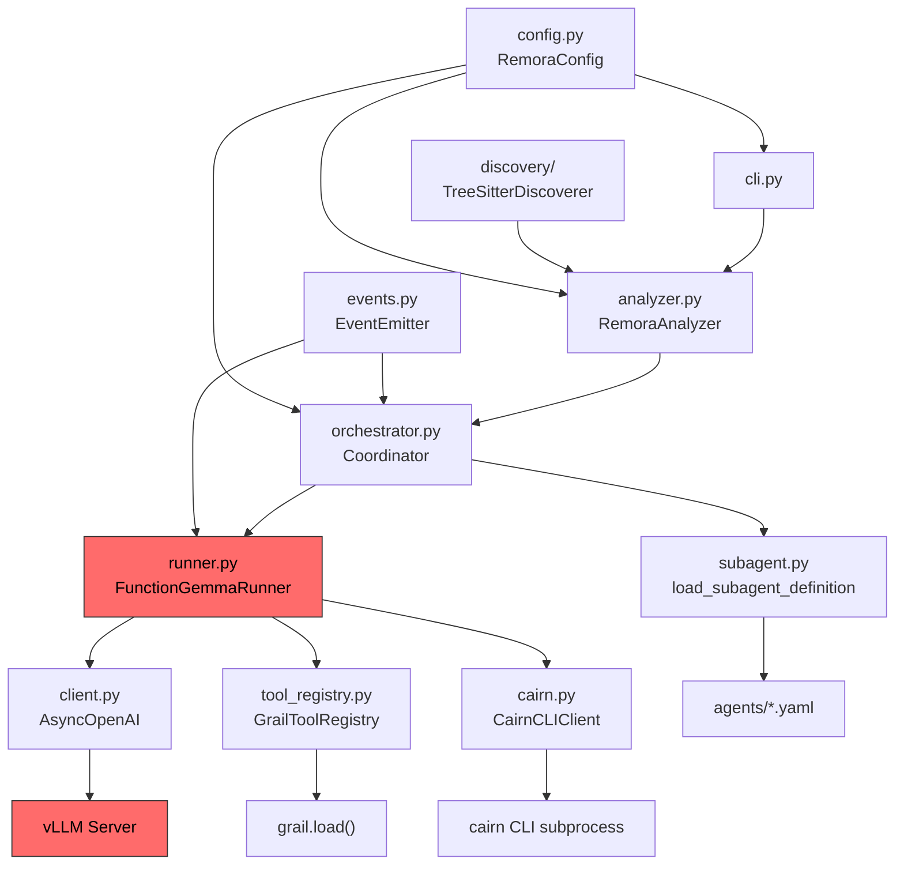

# Remora Code Review & vLLM FunctionGemma Root Cause Analysis

> Comprehensive review of the Remora library covering the vLLM FunctionGemma integration failure, architecture observations, and actionable improvements.

---

## Table of Contents

1. [vLLM FunctionGemma Root Cause Analysis](#1-vllm-functiongemma-root-cause-analysis)
2. [Architecture Overview](#2-architecture-overview)
3. [Critical Findings](#3-critical-findings)
4. [Library Utilization Review](#4-library-utilization-review)
5. [Code Quality & Design Observations](#5-code-quality--design-observations)
6. [Recommended Fixes](#6-recommended-fixes)

---

## 1. vLLM FunctionGemma Root Cause Analysis

### The Error

```
Error code: 400 - {'error': {'message': '1 validation error for
list[function-wrap[__log_extra_fields__()]]\n Invalid JSON: EOF while
parsing a list, at line 1 and column 1\n
input_value: [\n    \n    \n    \n ...
```

### Root Cause: `tool_choice='required'` vs `--tool-call-parser functiongemma`

The 400 error is caused by a **fundamental conflict** between two independent mechanisms in vLLM that both try to control tool-calling behavior:

| Mechanism | How It Works | Triggered By |
|-----------|-------------|--------------|
| **Structured Output (JSON Schema)** | Constrains token generation to produce valid JSON matching the tool schema via grammar-guided decoding | `tool_choice='required'` or `tool_choice={'type': 'function', ...}` |
| **Tool Call Parser** | Post-processes free-form model output, extracting tool calls using regex after generation | `--tool-call-parser functiongemma` server flag |

#### What happens step-by-step:

1. **Remora sends** `tool_choice='required'` to the vLLM API ([runner.py:_call_model](file:///c:/Users/Andrew/Documents/Projects/remora/remora/runner.py))
2. **vLLM activates structured output mode** — it constrains the model's token sampling to only produce valid JSON matching the tool schema
3. **FunctionGemma doesn't know JSON** — it was trained to produce `<start_function_call>call:func_name{key:value}<end_function_call>`, not OpenAI-style JSON
4. **The model produces whitespace/garbage** — under JSON schema constraints, FunctionGemma can't produce its native format, so it generates whitespace characters that happen to be "valid" prefixes of JSON (`[\n    \n    \n ...`)
5. **vLLM's JSON parser fails** — the whitespace-only output is invalid JSON → `EOF while parsing a list`

#### Why the `FunctionGemmaToolParser` never fires

The `FunctionGemmaToolParser` (from `--tool-call-parser functiongemma`) is designed for **`tool_choice='auto'`** mode, where:
- The model generates tokens freely (no JSON constraints)
- The model produces `<start_function_call>...<end_function_call>` tags natively
- The parser extracts tool calls from this text via regex after generation

When `tool_choice='required'`, vLLM bypasses the tool call parser entirely and instead uses the structured output backend (grammar-guided decoding / outlines). The parser is never consulted.

> [!CAUTION]
> **This is not a bug in Remora, vLLM, or FunctionGemma individually.** It is a configuration incompatibility. The `tool_choice='required'` setting is correct for models that produce OpenAI-style JSON tool calls (e.g., Mistral, Llama-3). It is **incorrect** for FunctionGemma, which uses a custom non-JSON format.

### The Fix

```diff
# remora.yaml
runner:
-  tool_choice: "required"
+  tool_choice: "auto"
```

And in `runner.py`, the `_tool_choice_for_turn` logic must be adapted:

```diff
- # When tool_choice is 'required', force all turns to call tools
- # On the last turn, switch to 'submit_result' to force submission
+ # When tool_choice is 'auto', FunctionGemma decides when to call tools
+ # On the last turn, we can hint with tool_choice to force submission
```

> [!IMPORTANT]
> With `tool_choice='auto'`, the model may choose not to call any tools on some turns. The runner's `_handle_no_tool_calls` method already handles this by returning the text content. However, the current default behavior raises `AGENT_003` when `tool_choice='required'` and no tool calls are made. Switching to `'auto'` means the runner must tolerate turns with no tool calls more gracefully.

### Additional Considerations

1. **`max_tokens=512` may be too low** — FunctionGemma's tool call format includes the full argument serialization. Complex tool calls with long string arguments could be truncated, causing parse failures in the `FunctionGemmaToolParser`.

2. **`submit_result` as tool_choice** — The current code sets `tool_choice={'type': 'function', 'function': {'name': 'submit_result'}}` on the last turn. With `auto` mode, this named tool_choice hint may still trigger structured output constraints. Consider using `auto` on all turns and relying on the system prompt to instruct the model to call `submit_result` when done.

3. **Temperature 0.1** — Very low temperature is fine for deterministic tool use, but combined with a small model (270M params), it can cause the model to get stuck in repetitive patterns. Consider experimenting with 0.2–0.3.

---

## 2. Architecture Overview



The red-highlighted path (`Runner → vLLM`) is where the FunctionGemma failure occurs.

### Data Flow

1. **CLI** parses arguments → loads config → creates `RemoraAnalyzer`
2. **RemoraAnalyzer** runs `TreeSitterDiscoverer` to find code nodes (functions, classes, methods)
3. For each node × operation, **Coordinator** creates a `FunctionGemmaRunner`
4. **FunctionGemmaRunner** loads the subagent definition, builds tool schemas via `GrailToolRegistry`, and sends chat completion requests to vLLM
5. Tool calls from the model are dispatched to **CairnCLIClient** which executes Grail `.pym` scripts
6. Results are collected into `AgentResult` → `NodeResult` → `AnalysisResults`

---

## 3. Critical Findings

### 3.1 `runner.py` — Hardcoded Model Assumptions

**Severity: High**

The `FunctionGemmaRunner` name and logic assume FunctionGemma is the only model. But the architecture (LoRA adapters, configurable `model_id` per operation) suggests support for multiple model types.

**Issues:**
- The class name `FunctionGemmaRunner` couples the runner to a specific model family
- The `_tool_choice_for_turn` method makes FunctionGemma-specific assumptions about how `submit_result` works
- No abstraction layer for different model output formats (FunctionGemma tags vs OpenAI JSON)

**Recommendation:** Rename to `AgentRunner` and extract model-specific behavior into a strategy pattern or configuration:

```python
class AgentRunner:
    """Model-agnostic agent runner."""
    
    def __init__(self, ..., output_format: Literal["functiongemma", "openai_json"] = "functiongemma"):
        ...
```

### 3.2 `tool_registry.py` — Silent Failures in Schema Building

**Severity: Medium**

The `_build_tool_schema` method in `GrailToolRegistry` catches broad exceptions and returns `None` for invalid tools, logging only a warning. This means a misconfigured `.pym` file silently removes a tool from the schema, leading to confusing agent behavior.

```python
# Current: tools that fail to load are silently dropped
tools_payload = [schema for schema in [...] if schema is not None]
```

**Recommendation:** Fail loudly on schema build errors during initialization. Silent tool removal makes debugging extremely difficult.

### 3.3 `orchestrator.py` — Exception Swallowing in `run_with_limit`

**Severity: Medium**

The `run_with_limit` closure catches *all* exceptions from `runner.run()`, logs them as events, and returns them as the result. This means that programming errors (e.g., `TypeError`, `AttributeError`) in the runner are treated the same as model errors — they're logged but never raised to the caller.

```python
except Exception as exc:  # Too broad — catches bugs
    # ... logs event and returns exc as result
    return operation, exc
```

**Recommendation:** Distinguish between `AgentError` (expected model/tool failures) and unexpected exceptions. Re-raise unexpected exceptions.

### 3.4 `cairn.py` — CLI Subprocess as the Only Integration

**Severity: Low (Design Observation)**

Remora interacts with Cairn exclusively via `asyncio.create_subprocess_exec("cairn", "run", ...)`. The `.context/cairn` source shows Cairn has a rich Python API (`CairnOrchestrator`, `AgentContext`, `CairnExternalFunctions`, etc.) that could be used directly.

**Trade-off:** The subprocess approach provides process isolation (a misbehaving .pym can't crash Remora), but it adds ~100ms latency per tool call and makes error reporting less granular.

**Recommendation:** Consider offering both modes: subprocess (default/safe) and in-process (faster, for trusted scripts). This could be configured per-operation.

### 3.5 `config.py` — No Validation of `tool_choice` Against Model Type

**Severity: High (Direct cause of the vLLM bug)**

The `RunnerConfig` accepts any string for `tool_choice` without validating it against the model being used:

```python
tool_choice: str = "required"  # No validation against model capabilities
```

The config doesn't warn or error when `tool_choice='required'` is used with a FunctionGemma model, which is known to be incompatible.

**Recommendation:** Add a model-aware validation step, or at minimum document the incompatibility prominently:

```python
class RunnerConfig(BaseModel):
    tool_choice: Literal["auto", "required", "none"] = "auto"  # Changed default
    
    @model_validator(mode="after")
    def _warn_functiongemma_required(self) -> Self:
        # Could check server.default_adapter here if accessible
        ...
```

---

## 4. Library Utilization Review

### 4.1 OpenAI Python SDK — Well Utilized

The `AsyncOpenAI` client is used correctly via `client.chat.completions.create()`. The SDK is used for:
- Chat completions with tool calling ✓
- Proper error handling with `openai.APIConnectionError` ✓
- Configuration via `base_url`, `api_key`, `timeout` ✓

**Opportunity:** The SDK supports streaming (`stream=True`), which could provide real-time progress feedback for long-running agent turns. Currently unused.

### 4.2 Pydantic — Mostly Well Utilized

Pydantic v2 is used for configuration and result models. Good practices observed:
- `model_config = ConfigDict(extra="ignore")` on `AgentResult` ✓
- Proper use of `Field(default_factory=...)` ✓
- `load_config` uses `model_validate` for structured parsing ✓

**Opportunity:** The `SubagentDefinition` in `subagent.py` is a plain dataclass, not a Pydantic model. Converting it to Pydantic would add:
- Automatic YAML schema validation
- Better error messages for malformed `.yaml` definitions
- Consistent validation across the codebase

### 4.3 Grail — Partially Utilized

Remora uses `grail.load()` to parse `.pym` files and extract input schemas, but only for **schema building** (generating JSON tool schemas for the LLM). The actual `.pym` execution is delegated to **Cairn CLI** via subprocess.

**Underutilized features:**
- `GrailScript.run()` — could execute scripts in-process instead of via Cairn CLI subprocess
- `GrailScript.check()` — could be used for pre-flight validation of all .pym files at startup
- `grail.Snapshot` / `GrailScript.start()` — could enable pause/resume patterns for long-running tools

### 4.4 Cairn — Minimally Utilized

Only the CLI subprocess is used (`cairn run <path> --workspace <id> --inputs <json>`). The rich Python API is completely unused:
- `CairnOrchestrator` — could replace the custom `Coordinator` class
- `AgentContext` / `AgentState` — could provide better state tracking
- `CairnExternalFunctions` — could provide external function injection
- `RetryStrategy` / `with_retry` — could replace manual retry logic
- `TaskQueue` / `TaskPriority` — could replace the `asyncio.Semaphore`-based concurrency control

> [!NOTE]
> Using the Cairn CLI is a deliberate design choice for process isolation. The Python API integration would be an optimization, not a correction.

### 4.5 Jinja2 — Correctly Used (but shouldn't need to be)

The `tool_chat_template_functiongemma.jinja` template is well-written and correctly formats the FunctionGemma prompt. However, this template should be provided to the **vLLM server** via `--chat-template`, not managed by Remora.

**Current flow:** Remora builds messages → sends via OpenAI API → vLLM uses its own chat template
**Correct flow:** Remora sends structured messages → vLLM applies the FunctionGemma chat template server-side

The template file in `server/` appears to be for use with `--chat-template` when launching the vLLM server. This is the correct approach, but it means the template is a **server configuration artifact**, not a library artifact.

### 4.6 tree-sitter — Well Utilized

The discovery module uses `tree-sitter` directly with `tree-sitter-python`, implementing a clean query-based discovery pipeline:
- `SourceParser` wraps `Parser` correctly ✓
- `QueryLoader` loads `.scm` query files ✓
- `MatchExtractor` processes captures and classifies functions vs methods ✓
- Node IDs are content-stable (hash of path:type:name, no byte offsets) ✓

---

## 5. Code Quality & Design Observations

### 5.1 Good Patterns

| Pattern | Where | Notes |
|---------|-------|-------|
| Protocol-based event emitters | `events.py` | `EventEmitter` protocol allows null/jsonl/controller implementations |
| Frozen dataclasses for discovery | `discovery/models.py` | `CSTNode` is immutable, preventing accidental mutation |
| Config loading with defaults + overrides | `config.py` | Clean merge of file config, defaults, and CLI overrides |
| Async context manager for coordinator | `orchestrator.py` | Proper cleanup of event watch tasks |
| Workspace-based isolation | `analyzer.py` | Each node/operation pair gets its own workspace ID |

### 5.2 Complexity Concerns

**`runner.py` is doing too much (~350 lines):**
- Message construction (system prompt, context, initial messages)
- API call construction and retries
- Tool call dispatching (Cairn subprocess execution)
- Result parsing and submit_result handling
- Debug event emission (request/response logging)
- Turn counting and tool_choice management

**Recommendation:** Extract responsibilities:
- `MessageBuilder` — constructs the initial message history from definition + node
- `ToolDispatcher` — handles Cairn/Grail tool execution
- `AgentRunner` — orchestrates the turn loop

**`cli.py` has significant duplication (~523 lines):**
The `_build_overrides` function is called identically from three commands (`analyze`, `watch`, `config`), each of which re-declares the same 13 CLI options. This could be refactored using Typer's callback system or a shared options class.

### 5.3 Error Handling Gaps

1. **No retry on transient vLLM errors** — A 503 (model loading) or 429 (rate limit) from vLLM causes immediate failure. The runner should retry with backoff.

2. **`_dispatch_tool` returns error strings** — When Cairn fails, the error is serialized as a string and sent back to the model as a tool result. The model may not understand the error format. Consider structured error responses.

3. **No timeout on individual turns** — If the model produces a very long response or the API hangs, there's no per-turn timeout. The only timeout is the global `server.timeout` on the HTTP client.

### 5.4 Testing Observations

The test directory has good coverage structure:
- Unit tests for config, discovery, subagent, runner, orchestrator
- Integration tests requiring a vLLM server
- Acceptance tests for end-to-end workflows
- Fixtures and conftest with mock helpers

However, the `test_runner.py` (14.7KB) tests mock the OpenAI client responses, which means the `tool_choice='required'` + FunctionGemma conflict would **not** be caught by unit tests — the mocks bypass vLLM's structured output enforcement.

**Recommendation:** Add an integration test that sends a real request to vLLM with `tool_choice='auto'` and verifies tool call extraction works end-to-end.

---

## 6. Recommended Fixes

### Priority 1: Fix the vLLM 400 Error (Immediate)

1. **Change default `tool_choice` to `'auto'`** in `config.py` and `remora.yaml`
2. **Update `_tool_choice_for_turn`** in `runner.py` to use `'auto'` for all turns
3. **Remove forced `submit_result` tool_choice** on the last turn — instead, add system prompt instructions telling the model to call `submit_result` when done
4. **Ensure the vLLM server is launched with** `--tool-call-parser functiongemma --chat-template server/tool_chat_template_functiongemma.jinja`

### Priority 2: Improve Robustness (Short-term)

5. **Add retries with backoff** for transient vLLM errors (503, 429, connection reset)
6. **Fail loudly on tool schema build errors** instead of silently dropping tools
7. **Add per-turn timeout** to prevent hung API calls from blocking the agent loop
8. **Narrow exception handling** in `orchestrator.py` `run_with_limit` to only catch `AgentError`

### Priority 3: Simplify Mental Model (Medium-term)

9. **Rename `FunctionGemmaRunner` → `AgentRunner`** to decouple from specific model
10. **Extract `MessageBuilder` and `ToolDispatcher`** from the runner
11. **Deduplicate CLI options** using Typer callbacks or a shared dataclass
12. **Convert `SubagentDefinition` to Pydantic** for consistent validation

### Priority 4: Leverage Library APIs (Long-term)

13. **Evaluate using Cairn Python API** for in-process .pym execution (optional mode)
14. **Use `GrailScript.check()`** for pre-flight validation at startup
15. **Consider OpenAI streaming** for real-time progress on long agent turns
16. **Explore Cairn's `TaskQueue`/`RetryStrategy`** to replace custom concurrency control
