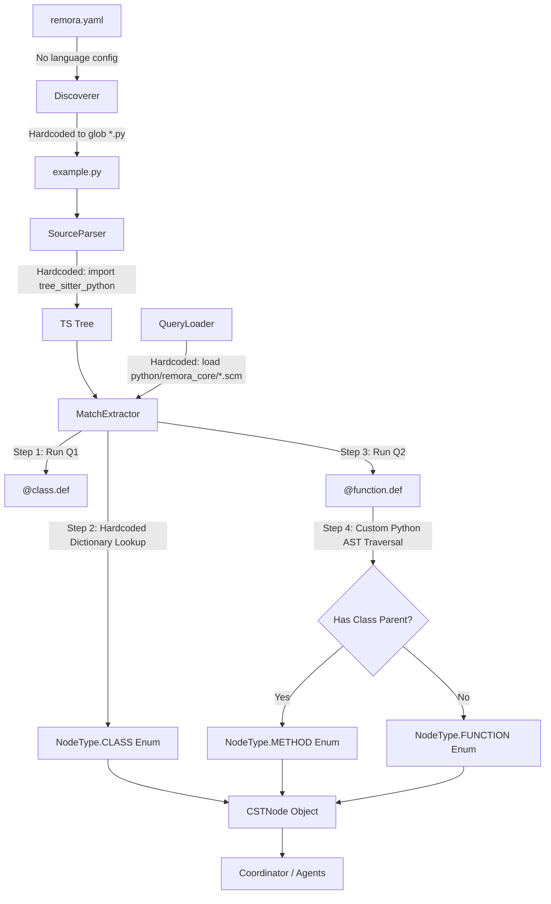
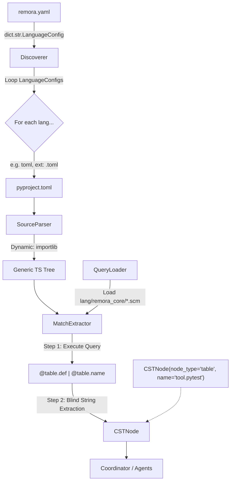

# Language Expansion Refactor Plan

This document outlines architectural strategies for expanding Remora's `discovery` module from a strictly Python-centric Tree-sitter parser to a generic, elegant, multi-language parser capable of driving the AST_MOMENTUM generative features.

**Core Philosophy:** The goal is the absolute best, most elegant, and cleanly maintainable codebase moving forward. We do not care about backwards compatibility or ease of implementation.

---

## 1. The Core Problem: The "Naming" Heuristic
Tree-sitter returns syntax nodes. Remora needs `CSTNode` objects that have a human-readable `name` (e.g. "MyClass.my_method") and a stable `NodeType` (e.g. `NodeType.METHOD`). 

In the current hardcoded Python implementation:
- `NodeType` is determined by hardcoded dictionary mapping: `"@class.def" -> NodeType.CLASS`
- `name` is extracted by specific Python logic:
  - Find a child node literally named "name".
  - If it's a `function_definition`, walk up the AST in Python to see if the parent is a `class_definition`. If so, it's a `METHOD` and prepend the class name.

When we add TOML (e.g., extracting a `[tool.pytest]` table name) or Markdown (e.g., getting the text of an `## H2 Header`), this hardcoded logic completely breaks down.

---

## Option A: Pure Data-Driven Polymorphism (The "Smart Queries" Approach) - Highly Recommended

Instead of using Python to write complex logic for *how* to extract names or classify nodes for different languages, we push 100% of the extraction logic to the `.scm` files and configure the pipeline purely via static data.

If a language can be parsed by Tree-sitter, we should be able to query *everything* we need directly using Tree-sitter queries. 

### Architecture

1. **The Registry Config**: A pure data definition (e.g., built into the config or a `languages.toml`) that defines the parsing capabilities:
```toml
[language.python]
extensions = [".py"]
grammar_module = "tree_sitter_python"

[language.toml]
extensions = [".toml"]
grammar_module = "tree_sitter_toml"
```

2. **The `.scm` Contract**: The python engine no longer tries to guess relationships. It enforces a strict grammar on the `.scm` files themselves. 
Every query that identifies a node **must** capture:
- `@node.def`: The full byte-range of the node.
- `@node.name`: The byte-range of the identifier string.

3. **Dynamic Node Typing**: We eliminate the hardcoded `NodeType` enum. If a query file is named `models.scm` and captures `@table.def`, the node type is simply `"table"`.

### Pros:
- **Zero Python Logic**: We never have to write Python AST walking code again. If we want to change how a Markdown header name is extracted, we edit the `markdown/discovery.scm` file.
- **Trivial Extensibility**: Adding a new language is literally just adding 3 lines to a TOML config and writing `.scm` files.
- **Language Agnostic Engine**: `TreeSitterDiscoverer` and `MatchExtractor` become universally applicable to any language Tree-sitter supports.

### Cons:
- Complex naming relationships (like Python's `Class.method` fully qualified name) require writing slightly more advanced `.scm` queries (using overlapping captures or predicates) rather than a simple Python `while node.parent:` loop.

---

## Option B: Object-Oriented `LanguageDialect` Plugins

This is the traditional "Strategy Pattern" approach. We define an abstract `LanguageDialect` interface, and each language implements its own python class to handle the quirks of its AST.

### Architecture

```python
class LanguageDialect(ABC):
    name: str
    extensions: tuple[str, ...]
    
    @abstractmethod
    def get_parser(self) -> tree_sitter.Language: ...
    
    @abstractmethod
    def extract_node_data(self, capture_name: str, ts_node: Node, source_bytes: bytes) -> tuple[str, str]:
        """Returns (NodeType, NodeName) using whatever python logic the language needs."""
```

### Pros:
- **Familiar Pattern**: Standard gang-of-four dependency injection.
- **Handles Edge Cases Easily**: If a language has a bizarre quirk that is hard to capture in `.scm`, you have the full power of Python to walk the AST to figure it out.

### Cons:
- **Heavier Footprint**: Every new language requires shipping and maintaining a new Python class file, rather than just `.scm` files.
- **Leaky Abstraction**: Mixing Tree-sitter `.scm` logic for discovery with Python logic for extraction means the "truth" of how a node is parsed is split across two domains.

---

## Option C: The Callback / Hook System

A middle-ground where the core engine uses `.scm` for everything, but allows languages to register arbitrary Python callback hooks to mutate the `CSTNode` right after it's birthed.

```python
def python_method_hook(node: CSTNode, ts_node: Node_ tree: Tree) -> CSTNode:
    # Walk the tree, if parent is class, prepend name and change type.
    pass

EXTRACTOR_HOOKS = {
    "python": [python_method_hook]
}
```

### Pros:
- Keeps the core engine agnostic but provides an escape hatch.

### Cons:
- Action-at-a-distance. Hooks make it very hard to trace why a node was named a certain way or why its type changed.

---

## Recommendation: Option A (Pure Data-Driven "Smart Queries")

If we want the *best* and most elegant architecture moving forward, **Option A is the clear winner.**

We should push Tree-sitter to its limits. By forcing the `.scm` queries to be the sole source of truth for both *discovery* and *extraction*, we create a massively cleaner Python layer.

The core pipeline (`MatchExtractor.py`) shrinks significantly. It no longer cares if it's looking at Python, TOML, or Rust. It simply executes a query, looks for a `@X.def` capture, looks for a paired `@X.name` capture, and creates a `CSTNode` of type `X`. 

### The Architecture: Before vs. After

To visualize the impact of Option A, here is the architecture pipeline of Remora before and after the refactor.

#### The "Before" Architecture (Python-Centric)


*In the "Before" state, the `.scm` files only do half the job. Heavy, bespoke Python logic (Steps 2 & 4) is required to finish the classification and naming of the nodes.*

#### The "After" Architecture (Pure Data-Driven / Option A)


*In the "After" state, the Python pipeline is incredibly thin and dumb. It blindly trusts the `.scm` grammar to define both the bounds (`.def`) and the type/name (`.name`) natively. The entire Python AST traversal step is eradicated.*

**The elegance comes from the constraint:** If a language feature cannot be expressed cleanly by capturing its definition and its name in an `.scm` file, it shouldn't be a primitive Node Type in our system.

## Action Plan & Code Changes for Option A

To implement this pure data-driven system, we need to completely decouple Remora from Python, `tree-sitter-python`, and the hardcoded `NodeType` enum.

### 1. Update Dependencies (`pyproject.toml`)
We need the generic `tree-sitter` library and specific parsers. 
```toml
# In pyproject.toml
dependencies = [
    "tree-sitter",
    "tree-sitter-python",
    "tree-sitter-toml",
    "tree-sitter-markdown",
]
```

### 2. The Configuration Schema (`src/remora/config.py`)
Add a new model to define our supported language dialects natively within Remora's configuration.

```python
class LanguageConfig(BaseModel):
    extensions: list[str]
    grammar_module: str  # e.g., "tree_sitter_python"

class DiscoveryConfig(BaseModel):
    # Existing settings...
    languages: dict[str, LanguageConfig] = Field(
        default_factory=lambda: {
            "python": LanguageConfig(extensions=[".py", ".pyi"], grammar_module="tree_sitter_python"),
            "toml": LanguageConfig(extensions=[".toml"], grammar_module="tree_sitter_toml"),
            "markdown": LanguageConfig(extensions=[".md"], grammar_module="tree_sitter_markdown")
        }
    )
```

### 3. Untying the Enum (`src/remora/discovery/models.py`)
Remove the strict `NodeType` enum entirely. Replace it with a pure `str` type alias (e.g., `NodeType = str`). The system must tolerate *any* string extracted from the query file.

```python
# Remove class NodeType(str, Enum) completely.
NodeType = str

@dataclass(frozen=True)
class CSTNode:
    node_id: str
    node_type: NodeType  # Now a generic string
    name: str            # Mapped purely from @node_type.name captures
    # ...
```

### 4. Generic Source Parsing (`src/remora/discovery/source_parser.py`)
Update the `SourceParser` and `QueryLoader` to dynamically load `tree-sitter` language binaries based on the active `LanguageConfig` using `importlib`, removing the hardcoded `PY_LANGUAGE`.

```python
import importlib

class SourceParser:
    def __init__(self, lang_config: LanguageConfig) -> None:
        # Dynamically import the grammar module
        grammar_pkg = importlib.import_module(lang_config.grammar_module)
        self.ts_language = Language(grammar_pkg.language())
        self._parser = Parser(self.ts_language)

    # parse_file, parse_bytes logic remains exactly the same
```

### 5. Smart Query Matching (`src/remora/discovery/match_extractor.py`)
This is the heart of the refactor. We delete `_extract_name_from_node` and `_classify_function`, along with `_PREFIX_TO_NODE_TYPE`. We mandate that `.scm` groups define their own types.

```python
class MatchExtractor:
    def _run_query(self, file_path: Path, tree: Tree, source_bytes: bytes, compiled_query) -> list[CSTNode]:
        cursor = QueryCursor(compiled_query.query)
        captures = cursor.captures(tree.root_node)
        
        # In tree-sitter, we group related captures (e.g. @method.def and @method.name) 
        # by checking if they belong to the same Match object.
        # Alternatively, we iterate through captures and group by AST parent context.
        nodes = []
        
        # Simplified MVP extraction logic relying entirely on .scm captures
        def_captures = {name: ts_node for name, ts_node in captures.items() if name.endswith(".def")}
        name_captures = {name: ts_node for name, ts_node in captures.items() if name.endswith(".name")}
        
        for def_capture_name, def_node in def_captures.items():
            node_type_str = def_capture_name.split(".")[0] # e.g. "@class" -> "class"
            node_type_str = node_type_str.lstrip("@")
            
            # Find the corresponding .name capture for this definition
            # (In reality, we match these via tree-sitter QueryMatch indices rather than global captures.items())
            name_capture_key = f"@{node_type_str}.name"
            
            name_text = "unknown"
            if name_capture_key in name_captures:
                name_ts_node = name_captures[name_capture_key]
                name_text = source_bytes[name_ts_node.start_byte : name_ts_node.end_byte].decode("utf-8")
                
            nodes.append(CSTNode(
                node_id=compute_node_id(file_path, node_type_str, name_text),
                node_type=node_type_str,
                name=name_text,
                start_byte=def_node.start_byte,
                end_byte=def_node.end_byte,
                #...
            ))
            
        return nodes
```

### 6. The Discoverer (`src/remora/discovery/discoverer.py`)
Update `TreeSitterDiscoverer` to loop over all configured languages.

```python
class TreeSitterDiscoverer:
    def discover(self) -> list[CSTNode]:
        all_nodes = []
        for lang_name, config in self.config.discovery.languages.items():
            # 1. Initialize Parser & Loader for this specific config
            parser = SourceParser(config)
            loader = QueryLoader(config)
            extractor = MatchExtractor()
            
            # 2. Collect files matching the extensions mapped to this language
            lang_files = self._collect_files(config.extensions)
            queries = loader.load_query_pack(self.query_dir, lang_name, self.query_pack)
            
            # 3. Parse and extract
            for file_path in lang_files:
                tree, src_bytes = parser.parse_file(file_path)
                nodes = extractor.extract(file_path, tree, src_bytes, queries)
                all_nodes.extend(nodes)
```

### 7. Re-writing the `.scm` grammar
The grammar files must be updated to explicitly capture `@X.name` for everything, including the complex method resolutions we originally did in python. Tree-sitter query predicates (like `#match?` offsets or parent scoping) are used to differentiate functions from methods if we care to distinct them as types.

#### Python `discovery.scm` Example
```scheme
;; file: src/remora/queries/python/remora_core/models.scm

;; 1. Capture the entire file
(module) @file.def

;; 2. Capture classes
(class_definition
  name: (identifier) @class.name
) @class.def

;; 3. Capture Methods (functions inside classes)
(class_definition
  body: (block
    (function_definition
      name: (identifier) @method.name
    ) @method.def
  )
)

;; 4. Capture standalone Functions
;; (We would use a more complex predicate or exclusion approach here 
;;  to ensure we don't double-capture methods as functions, or we just let them both exist)
(function_definition
  name: (identifier) @function.name
) @function.def
```

#### TOML `discovery.scm` Example
```scheme
;; file: src/remora/queries/toml/remora_core/models.scm

;; Capture a TOML Table like [tool.pytest]
(table
  (dotted_key) @table.name
) @table.def
```

#### Markdown `discovery.scm` Example
```scheme
;; file: src/remora/queries/markdown/remora_core/models.scm

;; Capture ATX Headings (e.g., ## My Header)
(atx_heading
  (atx_h2_marker)
  (inline) @h2.name
) @h2.def
```

---

## 5. Impact Analysis: What else breaks?

If we drop the hardcoded Python `NodeType` enum and adopt this generic string-based architecture, we must audit the rest of Remora:

1. **`src/remora/testing/factories.py`**
   - **Impact**: High. It explicitly imports and uses `NodeType.FUNCTION` to stub out `CSTNode` objects in the test suite.
   - **Fix**: Change it to pass raw strings (e.g., `node_type="function"`).
   
2. **The LLM Agent Contexts (`kernel_runner.py` / `orchestrator.py`)**
   - **Impact**: Minor. `RemoraAgentContext` currently tracks `node_id`. It does not explicitly care about the `NodeType` enum. The LLM tools (via `grail` scripts) will simply receive the text of the nodes. They do not depend on the Python Enum.
   
3. **The CLI & Presenter (`cli.py`, `presenter.py`)**
   - **Impact**: None. The `AnalysisResults` and `ResultPresenter` logic loop over the objects dynamically. They print `{node.file_path.name}::{node.node_name}` but do not switch on the `NodeType` enum.
   
4. **Tool Definitions (`.pym` scripts)**
   - **Impact**: None right now, but conceptually massive. The `.pym` scripts will need to be written *per dialect* or be generic enough to handle multiple languages. For instance, a `lint.pym` script for Python knows how to run `ruff`. A `lint.pym` script for TOML might run `taplo`. The `agents_dir` structure will likely need to be subdivided by language (e.g., `agents/python/lint`, `agents/toml/lint`).

## Summary

The "Smart Queries" refactor (Option A) cleanly splits Remora's parser from its domain logic. It introduces `.scm` files as the absolute master contract. 

**Work Required:**
1. Update `pyproject.toml` dependencies.
2. Update `config.py` to support `discovery.languages`.
3. Wipe the `NodeType` enum from `models.py` and `factories.py`.
4. Refactor `SourceParser` to dynamically load `importlib.import_module`.
5. Refactor `MatchExtractor` to strip all Python heuristic walking logic, relying exclusively on `@type.name` capturing.
6. Refactor `TreeSitterDiscoverer` to loop the configured dialects.
7. Write the `python`, `toml`, and `markdown` baseline `.scm` files.
