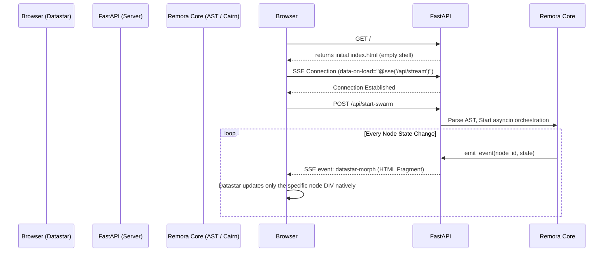
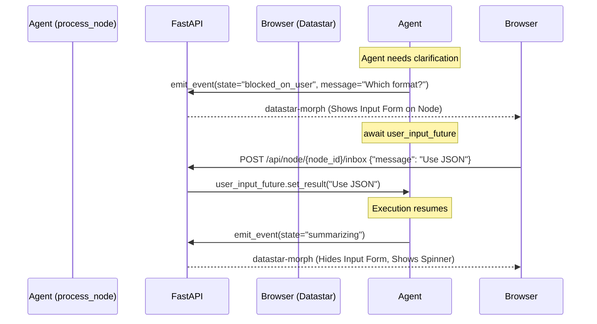

# Remora AST Swarm: Datastar Web TUI Concept

This document outlines the architecture for replacing the text-based Rich TUI (`demo/tui.py`) with a real-time, hypermedia-driven web dashboard using **FastAPI** and **Datastar**.

## 1. Goal

Create a "wow factor" real-time command center for Remora. Instead of watching custom `rich` tables print to a terminal, users will view a live, structural rendering of their code's AST in the browser. As LLM agents provision workspaces and summarize nodes asynchronously, the UI will morph in real-time, identically mapping the structural progress of the codebase.

## 2. Technology Stack

*   **Core Orchestration**: Remora `ast_summary_demo.py` & `cairn` Workspaces
*   **Web Server**: FastAPI + Uvicorn
*   **Frontend**: HTML5 + Datastar (`data-star_` / `data-*` attributes)
*   **Styling**: Vanilla CSS (curated variables/layout) or a simple script-tag utility (e.g., UnoCSS) per user preference. *Note: Global rules enforce Vanilla CSS unless Tailwind is explicitly requested, so we'll focus on clean Vanilla CSS flex/grid layouts with native CSS variables for themeing.*

## 3. Architecture Overview

### The Current Flow (JSONL to Rich TUI)
Currently, `ast_summary_demo.py` parses the target file into `AstNode` objects and concurrently processes each node. As state changes occur (start, provision, summarizing, finish), it writes JSON strings to `.remora_summary_events.jsonl`.
`demo/tui.py` runs in a separate process, `tail`ing that JSONL file and re-rendering a terminal UI 5 times a second.

### The New Flow (FastAPI + SSE + Datastar)
Instead of writing to a file, the `process_node` orchestration will yield Server-Sent Events (SSE) through FastAPI directly to the browser.



## 4. Agent Inbox & User Interaction

To enable true "Agentic Review," we need two-way communication. If an agent is stuck, needs clarification, or wants approval before merging code into a Cairn Workspace, it can halt its execution loop and wait for user input via an "Inbox."

### The Interaction Flow

1.  **Agent Pauses**: The LLM agent in the `process_node` loop decides it needs user input.
2.  **Inbox Event Emitted**: A specialized HTML fragment is emitted containing a message from the agent and a Datastar-powered input form.
3.  **User Replies**: The user types a response into the UI and clicks "Send."
4.  **FastAPI Routes Input**: The Datastar `@post()` sends the text back to FastAPI.
5.  **Agent Resumes**: FastAPI drops the user's message into an `asyncio.Future` or `Queue` specific to that agent's run loop, allowing the agent to continue execution with the new context.



### Extending the Node Fragment to Support Inboxes

We add an inbox section directly to the `node_fragment.html` that only appears when `node.is_blocked_on_user` is true:

```html
<!-- Added to node_fragment.html -->
<div class="agent-inbox"  hidden >
    <div class="agent-message">
        <strong>Agent:</strong> {{ node.blocked_message }}
    </div>
    
    <!-- Datastar form for submitting a reply -->
    <div class="user-reply-box">
        <!-- data-model binds the input to the Datastar store -->
        <input type="text" data-model="reply_{{ node.id }}" placeholder="Reply to agent...">
        
        <!-- Post the scoped store data back to the server -->
        <button data-on-click="@post('/api/node/{{ node.id }}/inbox')">
            Send Reply
        </button>
    </div>
</div>
```

### The FastAPI Backend Routes for Inboxes

To support this, the FastAPI server needs a way to route incoming messages back to the specific paused `asyncio` task. We can use a global dictionary of `asyncio.Future` objects keyed by the `node.id`.

```python
# In demo/web_app.py or web_events.py
from pydantic import BaseModel

class ReplyPayload(BaseModel):
    pass # Datastar parses data-model directly into the form/json body

# Store futures for awaiting tasks
pending_user_inputs: dict[str, asyncio.Future] = {}

@app.post("/api/node/{node_id}/inbox")
async def handle_agent_reply(node_id: str, request: Request):
    # Datastar standard sends the full store as JSON by default for a @post
    store_data = await request.json()
    reply_text = store_data.get(f"reply_{node_id}", "")
    
    # Resume the agent
    if node_id in pending_user_inputs:
        pending_user_inputs[node_id].set_result(reply_text)
        del pending_user_inputs[node_id]
        
    return HTMLResponse("<div>Message Sent. Resuming Agent...</div>")
```

### Implementing in `process_node.py`

Inside the orchestration logic, we create a helper that pauses execution.

```python
async def ask_user(node: AstNode, message: str) -> str:
    """Pauses the node processing, updates UI, and waits for a reply."""
    node.status = "blocked_on_user"
    node.blocked_message = message
    await emit_html_fragment(render_template("node_fragment.html", node=node))
    
    # Create the wait hook
    loop = asyncio.get_running_loop()
    future = loop.create_future()
    pending_user_inputs[node.id] = future
    
    # Pauses this task until the Datastar POST resolves the future
    reply = await future 
    
    # Clean up and resume
    node.status = "summarizing"
    node.blocked_message = None
    await emit_html_fragment(render_template("node_fragment.html", node=node))
    
    return reply
```

    return reply
```

### User-Initiated (Asynchronous) Agent Inbox

In addition to agents pausing to ask for input, users should be able to proactively send messages to any currently active agent (e.g., "Make sure you include XYZ in the summary"). We handle this by adding an asynchronous message queue to the agent's context.

1.  **Always-Available Inbox:** Every active node in the UI has an input field.
2.  **Queue Injection:** When a user submits a message, the Datastar route pushes the message into an `asyncio.Queue` bound to that specific node.
3.  **Agent Polling / Context Injection:** The structured agent's system prompt or tool-calling loop is configured to periodically check its inbox queue. If a new message is found, it injects the message into its context before making the next tool call / LLM generation.

```python
# In demo/web_app.py
from collections import defaultdict
import asyncio

# Queue for async, user-initiated messages per node
agent_inboxes: dict[str, asyncio.Queue] = defaultdict(asyncio.Queue)

@app.post("/api/node/{node_id}/send-message")
async def send_async_message(node_id: str, request: Request):
    store_data = await request.json()
    message = store_data.get(f"user_msg_{node_id}", "")
    
    if message:
        await agent_inboxes[node_id].put(message)
    
    # Optionally morph a small "Message received" toast notification onto the node
    return HTMLResponse("<div>Message sent to agent!</div>")
```

Inside the loop running the generic Remora agent bundle:
```python
# Inside the agent's execution loop orchestration
async def check_inbox(node_id: str):
    messages = []
    queue = agent_inboxes[node_id]
    
    # Drain the queue of any newly received messages
    while not queue.empty():
        messages.append(queue.get_nowait())
        
    if messages:
        # Inject the new context directly into the agent's prompt history
        agent.add_user_message("User interrupted with new context: " + "\n".join(messages))
```

## 5. Integration Details (Code Changes)

### A. Replacing the `EventHandler`
We will replace the file-based `emit_event` function in `scripts/ast_summary_demo.py` with an `asyncio.Queue`. 

```python
# new: demo/web_events.py
import asyncio
from typing import Any

event_queue: asyncio.Queue[str] = asyncio.Queue()

async def emit_html_fragment(fragment: str):
    """Pushes a rendered HTML fragment to the SSE queue."""
    await event_queue.put(fragment)
```

### B. The HTML Templates (Jinja2)
We'll use Jinja2 to render the HTML snippets on the server before dropping them into the queue.

*Template: `node_fragment.html`*
```html
<!-- The id MUST match exactly for Datastar morphing to work -->
<div id="node-{{ node.id }}" class="node-card status-{{ node.status }}">
    <div class="node-header">
        <span class="badge {{ node.node_type|lower }}">{{ node.node_type }}</span>
        <span class="node-name">{{ node.name }}</span>
        
        
            <span class="spinner"></span>
        
            <span class="check-icon">✓</span>
        
    </div>
    
    <div class="node-content">
        
            <div class="summary-text">{{ node.summary }}</div>
        
    </div>
    
    <!-- Render nested children recursively inside this node container -->
    <div class="children-container" id="children-{{ node.id }}">
        <!-- Children morph in here -->
    </div>
</div>
```

### C. Updating `process_node`
`scripts/ast_summary_demo.py`'s `process_node` function will be updated to trigger `emit_html_fragment` instead of writing JSONL.

```python
async def process_node(node: AstNode, ...):
    node.status = "pending"
    await emit_html_fragment(render_template("node_fragment.html", node=node))
    
    # ... process children ...
    
    node.status = "summarizing"
    await emit_html_fragment(render_template("node_fragment.html", node=node))
    
    # ... provision workspace, await LLM ...
    
    node.status = "done"
    node.summary = summary
    await emit_html_fragment(render_template("node_fragment.html", node=node))
```

### D. The FastAPI Server (`demo/web_app.py`)
This script ties the UI and logic together.

```python
import asyncio
from fastapi import FastAPI, Request
from fastapi.responses import HTMLResponse, StreamingResponse
from fastapi.staticfiles import StaticFiles
from fastapi.templating import Jinja2Templates

# Import the existing AST logic
from scripts.ast_summary_demo import main as start_ast_swarm
from demo.web_events import event_queue

app = FastAPI()
app.mount("/static", StaticFiles(directory="demo/static"), name="static")
templates = Jinja2Templates(directory="demo/templates")

@app.get("/", response_class=HTMLResponse)
async def get_dashboard(request: Request):
    return templates.TemplateResponse("index.html", {"request": request})

@app.post("/api/start")
async def start_swarm():
    # Kick off the orchestration as a background task
    asyncio.create_task(start_ast_swarm())
    return HTMLResponse("<div id='status'>Swarm Started!</div>")

async def sse_generator():
    """Consumes the queue and formats as SSE for Datastar."""
    while True:
        html_fragment = await event_queue.get()
        # Datastar requires specific SSE formatting
        yield f"event: datastar-morph\ndata: {html_fragment}\n\n"

@app.get("/api/stream")
async def stream_events():
    return StreamingResponse(sse_generator(), media_type="text/event-stream")
```

## 5. Directory Structure for the Web Demo

```text
remora/
├── demo/
│   ├── web_app.py         # FastAPI App
│   ├── web_events.py      # asyncio.Queue singleton
│   ├── static/
│   │   └── style.css      # Vanilla CSS for styling node trees
│   └── templates/
│       ├── index.html           # The shell (includes datastar script payload)
│       └── node_fragment.html   # The morph target for the AST nodes
├── scripts/
│   └── ast_summary_demo.py # Orchestrates nodes, now pushes to web_events
```

## 6. Execution

When we implement this, the user simply runs:
`uvicorn demo.web_app:app --reload`

They navigate to `http://localhost:8000`, click "Start Swarm", and watch the HTML DOM organically grow and morph exactly in sync with the Python AST code discovery and backend LLM agent loop!
