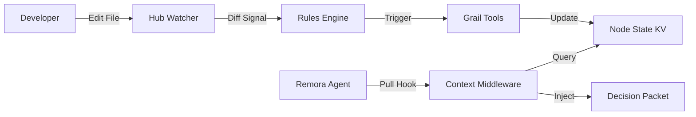

# Node State Hub Concept (v2)

## Executive Summary

**Problem**: Agents need deep context (signatures, related tests, complexity metrics) to make good decisions, but computing this context at runtime is slow and expensive.

**Solution**: The **Node State Hub** is a background daemon that watches the codebase. When a file changes, it purely *deterministically* updates a structured **Node State** cache.
-   It does **not** use an LLM to "decide" what to do (unlike v1).
-   It simply runs fast, static analysis tools (`grail` scripts) to keep the context fresh.

**Integration**: This fresh context is then **pulled** by the Agent's *Short Track Memory* (v2) at the start of each turn, ensuring the model always sees the latest state of the world without waiting.

---

## The Mental Model: "Smart Cache"

Think of the Hub as a **Live Database of your Code**.

1.  **You type code** in your editor.
2.  **Hub sees the file change**.
3.  **Hub computes metadata** (AST hash, function signatures, list of tests).
4.  **Agent queries Hub**: "What do you know about `login.py`?"
5.  **Hub replies instantly**: "Here is the signature, 2 related tests, and the last known complexity score."

### Key Shift from V1
-   **V1**: "Hub is a sidecar agent that *thinks* about your code." (Too complex, slow).
-   **V2**: "Hub is a deterministic engine that *indexes* your code." (Fast, reliable).

---

## Architecture

### 1. The Cycle

### 2. Components

#### A. Change Detection (The Watcher)
-   Monitors file system events.
-   Computes `sha256(node_source)`.
-   If `current_hash != stored_hash`, triggers an update.

#### B. Rules Engine (Deterministic)
Replaces the "Triage AI". Simple if-this-then-that logic.
-   **Always**: Run `extract_signature` and `scan_imports`.
-   **If signature changed**: Run `find_callers`.
-   **If new function**: Run `find_tests`.

#### C. Update Scripts (The Workers)
Standard `Grail` tools (sandboxed Python scripts).
-   `extract_signature.pym`: Fast AST parsing.
-   `compute_complexity.pym`: Cyclomatic complexity check.
-   `find_tests.pym`: Regex/AST search for test files.

#### D. Node State KV (The Storage)
A fast, local Key-Value store (using `fsdantic` on SQLite or JSON).
**Key**: `node:{file_path}:{node_name}`
**Value**: `NodeState` object.

---

## Integration with Two-Track Memory (V2)

The Hub feeds the **Short Track**.

1.  **The Pull Hook**:
    -   At the start of a turn, `ContextManager` looks at `decision_packet.recent_history`.
    -   It identifies the files/nodes the agent is currently working on.
    -   It calls `HubClient.get_context(nodes)`.

2.  **The Injection**:
    -   The Hub returns `NodeState` objects.
    -   The `ContextManager` updates `decision_packet.knowledge` with this fresh data.
    -   The `decision_packet.hub_context_freshness` field is updated to prove data lineage.

3.  **The Benefit**:
    -   The model doesn't need to call `read_file` just to see a signature.
    -   The model enters the turn *already knowing* the context.

---

## Use Cases (Deterministic First)

### 1. "Instant" Context
-   **Scenario**: User asks "Why is `login()` failing?"
-   **Hub**: Already knows `login()` calls `auth_utils.verify()`.
-   **Agent**: Starts with `auth_utils.verify()` already in context.

### 2. Test Discovery
-   **Scenario**: Agent modifies `process_payment()`.
-   **Hub**: Auto-updates the "Related Tests" list for `process_payment` because the previous run linked them.
-   **Agent**: Can immediately run `pytest tests/test_payment.py` without searching.

### 3. Drift Detection (Future / Optional)
-   **Scenario**: Function signature changes, but docstring doesn't.
-   **Hub**: Flags `docstring_outdated=True` in the state.
-   **Agent**: Sees the flag in the Decision Packet and suggests a fix.

---

## Future "Generative" Layer

We *can* add LLM features later, but they are **secondary**.
-   **On Demand**: Only run "Generate Summary" if the user requests it or if a "Major Refactor" flag is set.
-   **Cost Control**: By defaulting to deterministic tools, the Hub costs $0 to run in the background.
