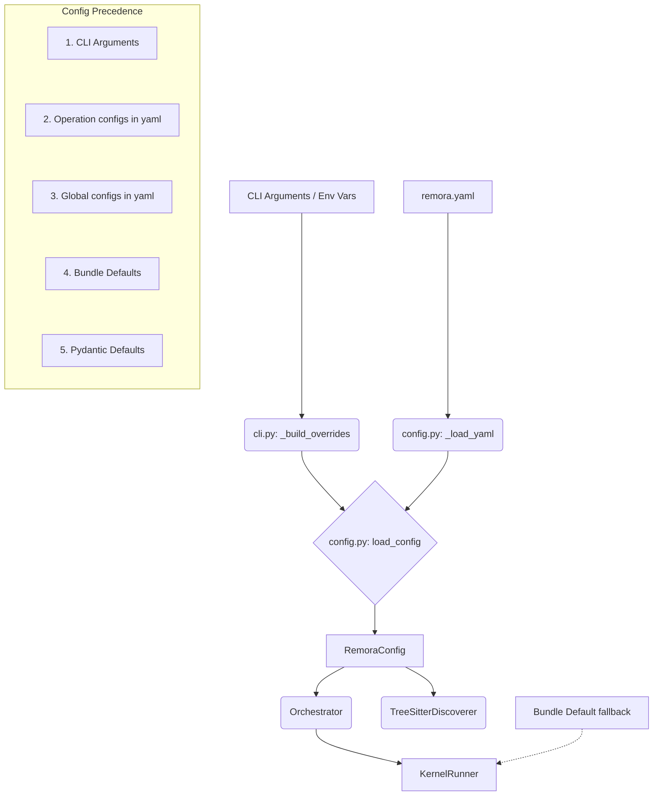

# Remora Medium Priority Refactor Guide

This guide provides step-by-step instructions for junior developers to complete the **Medium Priority** refactoring tasks identified in the Remora code review. Our goal is to achieve the cleanest, most elegant architecture possible. **Backwards compatibility is not a concern.**

Please follow this guide sequentially. After completing each step, ensure the accompanying testing instructions are fully satisfied before returning to the next step.

---

## Step 1: Refactor for Testability (Dependency Injection)

**Objective**: Decouple components from their concrete dependencies by using dependency injection or factory patterns. This makes it significantly easier to provide mocks or alternative implementations during testing.

### 1.1 Inject `GrailBackend` into `KernelRunner`
**File location**: `src/remora/kernel_runner.py`

Currently, `KernelRunner` directly instantiates `GrailBackend`, making it impossible to substitute a mock backend without `monkeypatch`. 

1. Update the `KernelRunner.__init__` signature to accept an optional `backend_factory`.
2. Update `_build_kernel` to use this factory instead of hardcoding `GrailBackend`.

```python
# In src/remora/kernel_runner.py

import typing
from typing import Callable, Any

# Add to imports if not present
from structured_agents.backends.grail import GrailBackend, GrailBackendConfig

class KernelRunner:
    def __init__(
        self,
        *args, **kwargs, # Keep existing arguments in place
        backend_factory: Callable[[GrailBackendConfig, Callable], GrailBackend] | None = None,
    ):
        # Keep existing initializations
        # ...
        self._backend_factory = backend_factory

    def _build_kernel(self) -> AgentKernel:
        # Keep existing config setup
        # ...
        backend_config = GrailBackendConfig(...) # Existing config
        
        # Use the factory if provided, otherwise default to GrailBackend
        if self._backend_factory:
            self._backend = self._backend_factory(backend_config, self._create_externals)
        else:
            self._backend = GrailBackend(
                config=backend_config,
                externals_factory=self._create_externals,
            )
        # ... rest of the method
```

### 1.2 Inject Tree-sitter Components into `TreeSitterDiscoverer`
**File location**: `src/remora/discovery/discoverer.py`

`TreeSitterDiscoverer` internally creates `SourceParser`, `QueryLoader`, and `MatchExtractor` in its initialization.

1. Modify `TreeSitterDiscoverer.__init__` to accept these components as optional parameters, instantiating defaults only if they are not provided.

```python
# In src/remora/discovery/discoverer.py

# Ensure these are imported
from remora.discovery.parser import SourceParser
from remora.discovery.queries import QueryLoader
from remora.discovery.extractor import MatchExtractor

class TreeSitterDiscoverer:
    def __init__(
        self,
        config: DiscoveryConfig, # Existing param
        parser: SourceParser | None = None,
        loader: QueryLoader | None = None,
        extractor: MatchExtractor | None = None,
    ):
        self.config = config
        self._parser = parser or SourceParser()
        self._loader = loader or QueryLoader()
        self._extractor = extractor or MatchExtractor()
```

### 🧪 Testing for Step 1
1. **Unit Tests**: Run `uv run pytest tests/` to ensure you haven't broken the default instantiation behavior.
2. **Mock Injection Test**: Create a temporary test snippet or add a unit test in `tests/test_kernel_runner.py` that instantiates `KernelRunner` with a lambda factory that returns a mock object. Assert that the runner configures without raising errors directly about `GrailBackend` failures.

---

## Step 2: Simplify Configuration & Add Validation

**Objective**: Address configuration bloat by mapping the configuration flow, documenting its precedence, and adding Pydantic validators that resolve conflicting settings directly in the models.

### 2.1 Configuration Architecture

Before making changes, it is critical to understand how configuration flows through Remora:



**Known Precedence Issues to Fix:**
1. `cairn.home` vs `agents_dir`: The `cairn.home` directory should default to a hidden folder inside `agents_dir` if not explicitly set.
2. `operations.*.model_id` vs `server.default_adapter`: An operation should inherit the global `default_adapter` if it doesn't specify its own `model_id`.

### 2.2 Add Configuration Precedence Documentation
**File location**: `src/remora/config.py`

Update the module docstring at the top of `config.py` to clearly define configuration precedence:

```python
"""
src/remora/config.py

Remora Configuration Module.

Configuration Precedence (Highest to Lowest):
1. CLI Arguments (e.g., --max-turns 5)
2. Operation-Specific Configs in remora.yaml (e.g., operations.lint.model_id)
3. Global Setting in remora.yaml (e.g., server.default_adapter)
4. Bundle Defaults (bundle.yaml in agent folder)
5. Pydantic Default Values
"""
```

### 2.3 Implement Configuration Validators
**File location**: `src/remora/config.py`

Add `model_validator` methods to `RemoraConfig` to validate mutually exclusive or nested settings and explicitly set fallbacks. 

```python
# In src/remora/config.py
from pydantic import BaseModel, Field, model_validator

class RemoraConfig(BaseModel):
    # ... existing fields ...
    
    @model_validator(mode='after')
    def validate_and_resolve_precedence(self) -> "RemoraConfig":
        # 1. Resolve cairn.home vs agents_dir overrides
        # Ensure cairn has a home directory even if not explicitly provided, routing it 
        # to a hidden folder inside the agents_dir.
        if hasattr(self, 'cairn') and not self.cairn.home and hasattr(self, 'agents_dir') and self.agents_dir:
            self.cairn.home = self.agents_dir / ".cairn"
            
        # 2. Model Adapter precedence
        # For each operation, if it doesn't specify a model_id, inherit from server.default_adapter
        if hasattr(self, 'operations') and hasattr(self, 'server'):
            for op_name, op_config in self.operations.items():
                if getattr(op_config, 'model_id', None) is None:
                    op_config.model_id = self.server.default_adapter
                    
        return self
```

### 🧪 Testing for Step 2
1. **Validation Tests**: Create a test file `tests/test_config_validation.py`. Validate that omitting the `model_id` in an operation correctly falls back to `server.default_adapter`, and verify the fallback population of `cairn.home`.
2. **Run Config Command**: Run `remora config --format yaml` in the CLI to see if the resolved output accurately reflects the validators you added.

---

## Step 3: Centralize Constants (Eliminate Magic Strings)

**Objective**: Centralize hardcoded strings into a single module to prevent typos and ease future refactoring.

### 3.1 Create the Constants Module
**File location**: `src/remora/constants.py`

Create this new file and define the global constants identified in the codebase:

```python
# src/remora/constants.py

from __future__ import annotations

# Tool Names
TERMINATION_TOOL = "submit_result"

# Directories & Files
CONFIG_DIR = ".remora"
HUB_DB_NAME = "hub.db"

# Defaults
DEFAULT_OPERATIONS = ["lint", "test", "docstring"]
```

### 3.2 Replace Magic Strings Globally
Search the codebase for the following strings and replace them with their respective constants from `remora.constants`. 

**Files to update for `submit_result` (`TERMINATION_TOOL`):**
- `src/remora/subagent.py`
- `src/remora/testing/mock_vllm_server.py`
- `src/remora/testing/factories.py`
- `tests/test_test_tools.py`
- `tests/test_subagent.py`
- `tests/test_sample_data_tools.py`
- `tests/test_lint_tools.py`
- `tests/test_kernel_runner.py`
- `tests/test_e2e_refactor.py`
- `tests/acceptance/test_mock_scenarios.py`

**Files to update for `hub.db` (`HUB_DB_NAME`):**
- `src/remora/hub/rules.py`
- `src/remora/hub/daemon.py`
- `src/remora/context/manager.py`
- `src/remora/config.py`

**Files to update for `"lint,test,docstring"` (`DEFAULT_OPERATIONS`):**
- `src/remora/cli.py` (Used in `analyze` and `watch` command Typer setups)
- `src/remora/config.py` (Used in `_default_operations` keys)
- `src/remora/testing/factories.py` (Default factory argument)

**Files to update for `.remora_cache` (`CACHE_DIR`):**
*(Note: Code review mentioned `.remora` but it was actually implemented as `.remora_cache`)*
- `src/remora/config.py` (Used in `WatchConfig.ignore_patterns` and `LlmLogConfig.output`)

**Example Refactor:**
```python
# Before
if tool_call.name == "submit_result":

# After
from remora.constants import TERMINATION_TOOL
if tool_call.name == TERMINATION_TOOL:
```

### 🧪 Testing for Step 3
1. **Full Test Suite**: Run `uv run pytest tests/` to ensure no imports were broken and behavior remains identical.
2. **Smoke Test**: Run a basic `remora analyze .` command. Since we replaced `DEFAULT_OPERATIONS` and `CONFIG_DIR`, a successful run implies the constants were wired up and resolvable.

---

## Step 4: Improve Cleanup via Context Managers

**Objective**: Ensure that workspace directories and temporary resources are deterministically cleaned up even when exceptions occur, preventing resource leaks.

### 4.1 Introduce `managed_workspace` Context Manager
**File location**: `src/remora/utils/fs.py` (Create this file if it doesn't exist, or place it in `src/remora/orchestrator.py` if no `utils` module is suitable)

Add a robust async context manager for workspace paths.

```python
# src/remora/utils/fs.py

import shutil
import contextlib
import asyncio
from pathlib import Path

@contextlib.asynccontextmanager
async def managed_workspace(path: Path):
    """Context manager to ensure workspace directories are created and deterministically cleaned up."""
    path.mkdir(parents=True, exist_ok=True)
    try:
        yield path
    finally:
        if path.exists():
            # Use asyncio.to_thread for blocking I/O directory removal
            await asyncio.to_thread(shutil.rmtree, path, ignore_errors=True)
```

### 4.2 Update `KernelRunner` Invocation
**File location**: `src/remora/orchestrator.py`

Find where the workspace is manually constructed and the `KernelRunner` is executed (likely inside an `except Exception as exc:` block without a `finally` or context manager). 

Refactor it to use the new `managed_workspace` context manager.

**Change from:**
```python
        workspace_path = workspace_root / "workspaces" / agent_id
        workspace_path.mkdir(parents=True, exist_ok=True)
        
        try:
            runner = KernelRunner(...)
            # run kernel
        except Exception as exc:
            errors.append(...)
        # No cleanup!
```

**Change to:**
```python
        from remora.utils.fs import managed_workspace
        # or from remora.orchestrator import managed_workspace if defined in the same file
        
        workspace_path = workspace_root / "workspaces" / agent_id
        
        try:
            async with managed_workspace(workspace_path) as active_workspace:
                runner = KernelRunner(...) # Make sure to pass the active_workspace path
                # run kernel inside the managed block
        except Exception as exc:
            from remora.errors import ExecutionError
            # Track execution error properly without swallowing
            errors.append(ExecutionError(f"KernelRunner failed for {agent_id}: {exc}"))
```

### 🧪 Testing for Step 4
1. **Mock Failure Test**: Temporarily add an artificial exception (e.g., `raise ValueError("Trigger Cleanup!")`) immediately after the `KernelRunner` line inside the `managed_workspace` block.
2. **Verify Cleanup**: Run an analysis via `remora analyze .`. Verify via your filesystem explorer or terminal that the temporary `workspaces/{agent_id}` directory is deleted automatically as the context manager exits, instead of being left orphaned.
3. Once confirmed, remove the temporary exception and verify normal successful operation.

---

## Step 5: Advanced Dependency Injection for High-Level Components

**Objective**: Extend the Dependency Injection practices from Step 1 to the higher-level orchestration layers (`RemoraAnalyzer` and `Coordinator`). This prevents these high-level control flows from being tightly coupled to concrete logic like disk I/O, tree-sitter, or internal runners. This makes unit testing the state transitions and concurrency limits of the core engines trivially easy without invoking actual agent or filesystem operations.

### 5.1 Inject `KernelRunner` Factory into `Coordinator`
**File location**: `src/remora/orchestrator.py`

**Before:** The `Coordinator` directly hardcodes the instantiation of a `KernelRunner` for every operation. To test the `Coordinator`'s concurrent limits (e.g., `max_concurrent_agents`), you must spin up an actual agent process. 

**After:** We inject a factory that `Coordinator` uses to build its runners. 

1. Create a TypeAlias near the top of the file:
   ```python
   RunnerFactory = Callable[..., KernelRunner]
   ```
2. Update the `Coordinator.__init__` to accept it:
   ```python
   class Coordinator:
       def __init__(
           self,
           config: RemoraConfig,
           *,
           event_stream_enabled: bool | None = None,
           event_stream_output: Path | None = None,
           runner_factory: RunnerFactory | None = None,
       ) -> None:
           # ... 
           self._runner_factory = runner_factory or KernelRunner
   ```
3. Update `process_node` to use the factory:
   ```python
           try:
               runner = self._runner_factory(
                   node=node,
                   ctx=ctx,
                   config=self.config,
                   bundle_path=bundle_path,
                   event_emitter=self._event_emitter,
                   workspace_path=workspace_path,
                   stable_path=None,
               )
   ```

**Implications:** A unit test can now pass a lambda that returns a `MockKernelRunner(async_run_delay=0.5)` to thoroughly test the orchestration limits entirely in memory.

### 5.2 Decouple `RemoraAnalyzer` from Concrete Managers
**File location**: `src/remora/analyzer.py`

**Before:** The `RemoraAnalyzer` directly instantiates `WorkspaceManager` (which does disk I/O through Cairn), `TreeSitterDiscoverer` (which reads from disk and parses code synchronously inline), and `Coordinator` (as a hardcoded context manager). 

**After:** We pass factories or default instances into `__init__`.

1. Update `RemoraAnalyzer.__init__`:
```python
    def __init__(
        self,
        config: RemoraConfig,
        event_emitter: EventEmitter | None = None,
        workspace_manager: WorkspaceManager | None = None,
        discoverer_factory: Callable[..., TreeSitterDiscoverer] | None = None,
        coordinator_cls: type[Coordinator] = Coordinator,
    ):
        self.config = config
        self._event_emitter = event_emitter or NullEventEmitter()
        # Allows mocking disk-based overlay operations
        self._workspace_manager = workspace_manager or WorkspaceManager() 
        self._discoverer_factory = discoverer_factory or TreeSitterDiscoverer
        self._coordinator_cls = coordinator_cls
```

2. Update `analyze()`:
```python
        # Use injected factory
        discoverer = self._discoverer_factory(
            root_dirs=paths,
            ...
        )
        self._nodes = await asyncio.to_thread(discoverer.discover)

        # Use injected class
        async with self._coordinator_cls(
            config=self.config,
            ...
        ) as coordinator:
```

**Implications:** When maintaining tests for `RemoraAnalyzer`, developers no longer need to stub out entire swaths of the file system, mock Cairn's internal overlay daemon, or parse real Python code. They can inject a mock discoverer that returns synthetic `CSTNode`s, and a mock coordinator that yields predefined `NodeResult`s, isolating the unit test entirely to the `Analyzer`'s behavior (like merge acceptance and result aggregation).

### 🧪 Testing for Step 5
1. **Unit Testing**: Run `uv run pytest tests/` to verify that default instantiation still functions correctly.
2. **Review Existing Mocks**: Check `tests/test_analyzer.py` or `tests/test_orchestrator.py`. If you find instances where `monkeypatch.setattr("remora.orchestrator.KernelRunner", ...)` is used, you can refactor those tests as practice to directly inject the mock via the new `__init__` factories!

> [!CAUTION]
> **No Production Changes Required for Call Sites**
> 
> The beauty of dependency injection with `or` default fallbacks is that it preserves exact backwards compatibility for the current codebase. 
> 
> You do **not** need to update `src/remora/cli.py` or anywhere else that instantiates `RemoraAnalyzer(config)`. The existing code will transparently fall back to the default `WorkspaceManager` and `Coordinator`. The *only* files that should change to leverage these new factories are your **test files**. By passing mock factories into the constructors within test files, you can now avoid using `monkeypatch` entirely for these deep integrations.
