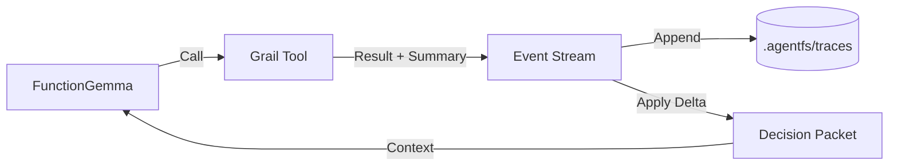

# Two-Track Memory Concept (v2)

> **"The Stream is the Truth. The Packet is the View."**

## 1. The Core Problem

We are building agents with **FunctionGemma (270M)**. This model is very small.
-   **It cannot read huge logs.** If we dump 100 lines of tool output into its context, it gets confused.
-   **It needs structured input.** It works best with a clean, concise JSON status object.

However, **Developers and Auditors need the full picture.**
-   If the agent fails, we need to know *exactly* what the tool returned (the raw error, the full stack trace).
-   We cannot throw away data just because the model can't read it.

## 2. The Solution: Two Tracks

We split memory into two distinct distinct tracks:

1.  **Long Track (The Event Stream)**: The canonical, immutable history of everything that happened.
    -   *Who sees it?* Developers, Auditors, Replay tools.
    -   *Content:* Full tool outputs, raw errors, timestamps, large data blobs.
    -   *Implementation:* A structured log file (JSONL) in `.agentfs/traces/`.

2.  **Short Track (The Decision Packet)**: A projection of the current state, derived from the Long Track.
    -   *Who sees it?* The LLM (FunctionGemma).
    -   *Content:* A concise JSON object comprising the "Working Memory".
    -   *Implementation:* An in-memory object, updated incrementally by events.

---

## 3. Architecture: Stream & Projection

Instead of managing two separate databases, we use a **Event Sourcing** pattern.



### The Cycle
1.  **The Model** sees the current `DecisionPacket`. It decides to call a tool.
2.  **The Tool** executes. It produces two things:
    -   **Result**: The full, raw output (e.g., a 500-line file content).
    -   **Summary**: A "Delta" that explains what changed (e.g., "Read 500 lines from file.py").
3.  **The Runner** emits a structured `Event` containing *both* the Result and the Summary.
4.  **The Context Manager** listens to the Event. It applies the **Summary** to the current `DecisionPacket`.
5.  **The Log** records the Event (including the Result) for posterity.

### Why this is better for Developers?
-   **Single Source of Truth**: The Event Log is the only thing you need to persist. If you have the log, you can replay the entire session and reconstruct the internal state of the agent at any point.
-   **Debuggability**: You can look at the log and see: "Ah, the tool returned a huge error (Long Track), but the summary only said 'Error occurred' (Short Track). No wonder the model didn't know how to fix it!"

---

## 4. Concepts in Detail

### The Event (Long Track)
An immutable record of an action.
```json
{
  "type": "tool_result",
  "timestamp": "2024-02-20T10:00:00Z",
  "tool": "read_file",
  "data": {
    "raw_output": "def foo()...\n(500 lines)...",  // The Long Track data
    "summary_delta": {                             // The Short Track update
      "recent_actions": ["Read file foo.py"],
      "file_context": ["foo.py"]
    }
  }
}
```

### The Decision Packet (Short Track)
The "Brain" of the agent. The implementation ensures this JSON object stays small (under ~3-4k tokens).
```json
{
  "goal": "Fix bug in foo.py",
  "recent_history": [
    "Read file foo.py",
    "Ran linter, found 3 errors"
  ],
  "knowledge": {
    "foo.py": "Contains class Bar..."
  },
  "last_error": "IndentError on line 5"
}
```

### The Projection
The logic that connects them.
`New_Packet = Old_Packet + Event.summary_delta`

### Hub Context Integration (The Pull Hook)
With the advent of the **Node State Hub**, the Context Manager must also support a "Pull" mechanism at the start of each turn.
1.  **Before** generating the prompt, the Context Manager queries the Hub.
2.  It asks: *"Do you have fresh state for nodes X, Y, Z?"* (where X,Y,Z are in `recent_history`).
3.  If yes, it updates the `knowledge` field of the `DecisionPacket`.
4.  This ensures the model acts on the *latest* code state, even if the tools haven't returned it yet.

---

## 5. Summary
-   **Don't build two databases.** Build one Event Stream.
-   **Project the State.** The Short Track is just a "view" of the Long Track, optimized for the model.
-   **Audit Everything.** Never show the model something that isn't recorded in the Long Track.
